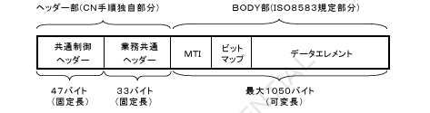
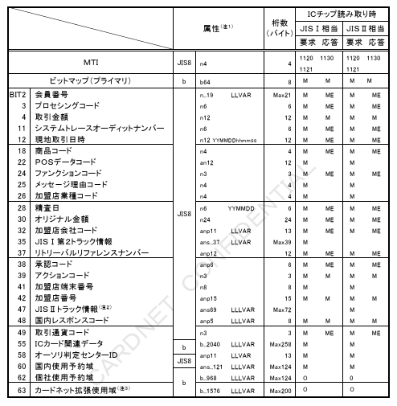
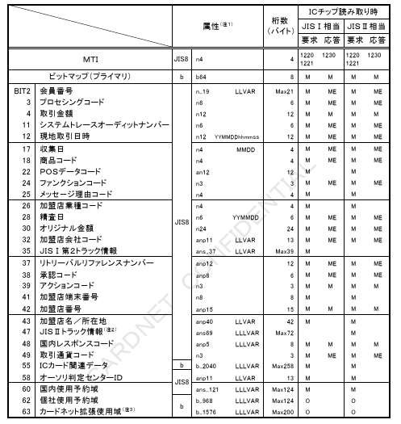
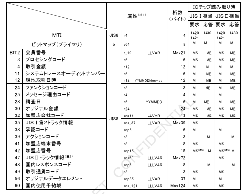

# 第３章　電文構成仕様

本章では、ICクレジットカード取引により変更される電文形式を定義する。

## ３．１．電文形式

CN手順で定義するメッセージは、ヘッダー部とBODY部より構成される。ヘッダー部は、共通制御ヘッダーと業務共通ヘッダーにて構成する。BODY部は、ISO8583（'93年度版）で規定されたMTI（電文タイプ）、ビットマップ、およびデータエレメントにて構成する。

【図】図３－１　電文形式

### ３．１．１．MTI（Message Type ID）

ICクレジットカード取引において使用されるMTI（電文タイプ）の一覧を表３－１に定義する。

表３－１　電文タイプ一覧

| MTI | 業務名 | 電文種別コード |
|---|---|---|
| 1100 | オーソリ／オーソリ（ARQC）要求 | C100/Q100 |
| 1110 | オーソリ／オーソリ（ARQC）応答 | C110/Q110 |
| 1120（1121） | オーソリアドバイス要求 | C120（C121） |
| 1130 | オーソリアドバイス応答 | C130 |
| 1200 | 売上要求 | C200 |
| 1210 | 売上応答 | C210 |
| 1220（1221） | 売上アドバイス要求 | C220（C221） |
| 1230 | 売上アドバイス応答 | C230 |
| 1420（1421） | 障害取消アドバイス要求 | Q420（Q421）／C420（C421） |
| 1430 | 障害取消アドバイス応答 | Q430／C430 |

注：Q420（Q421）は、取消対象取引がオーソリ（ARQC）の場合のみ使用される。

### ３．１．２．ビットマップ

ICクレジットカード取引により、BIT55「ICカード関連データ」が追加される。
IC電文のBODY部のビットマップパターンを表３－２－１～表３－２－５に示す。
なお、IC／MS電文変換サービスを利用する場合のMS電文のビットマップパターンについては、「CARDNET接続条件書（ダイレクト接続編）」参照。

表３－２－１　BODY部・オーソリ（ARQC）＜オンラインPINなし＞

注１：各項目の属性は、「CARDNET接続条件書（ダイレクト接続編）」の3.4「データエレメント」、3.5「実装方法」を参照のこと。

注２：JISⅡトラック情報は、「D／Smart」のみ設定可能。

注３：外貨取引決済DXX使用時またはタグA07使用時のみMax200バイトまで利用可能とし、その他取引の場合はMax124バイトまで利用可能とする。

表３－２－２　BODY部・オーソリ（ARQC）＜オンラインPINあり＞

注1：各項目の属性は、「CARDNET接続条件書（ダイレクト接続編）」の3.4「データエレメント」、3.5「実装方法」を参照のこと。

注2：JISⅡトラック情報は、「D／Smart」のみ設定可能。

注3：外貨取引決済DXX使用時またはタグA07使用時のみMax200バイトまで利用可能とし、その他取引の場合はMax124バイトまで利用可能とする。

表３－２－３　BODY部・オーソリアドバイス

注1：各項目の属性は、「CARDNET接続条件書（ダイレクト接続編）」の3.4「データエレメント」、3.5「実装方法」を参照のこと。

注2：JISⅡトラック情報は、「D／Smart」のみ設定可能。

注3：外貨取引決済やD/X使用時またはダイナA7使用時のみMax200バイトまで利用可能とし、その他取引の場合はMax124バイトまで利用可能とする。

表３－２－４　BODY部・売上アドバイス

注1：各項目の属性は、「CARDNET接続条件書（ダイレクト接続編）」の3.4「データエレメント」、3.5「実装方法」を参照のこと。

注2：JISⅡトラック情報は、「D／Smart」のみ設定可能。

注3：外貨取引決済DXX使用時またはタグA07使用時のみMax200バイトまで利用可能とし、その他取引の場合はMax124バイトまで利用可能とする。

表３－２－５　BODY部・障害取消アドバイス＜対オーソリ（ARQC）＞

注1：各項目の属性は、「CARDNET接続条件書（ダイレクト接続編）」の3.4「データエレメント」、3.5「実装方法」を参照のこと。

注2：JISⅡトラック情報は、「D／Smart」のみ設定可能。

注3：MSであるが、障害発生箇所によっては元取引の応答電文の値を設定する。詳細については、「CARDNET接続条件書（ダイレクト接続編）」8.3.23を参照。
