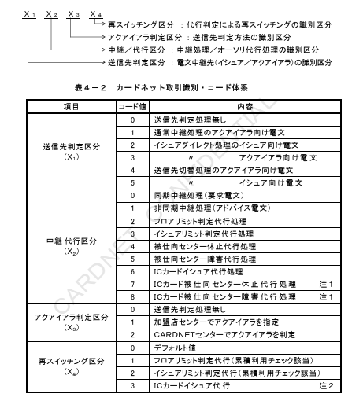
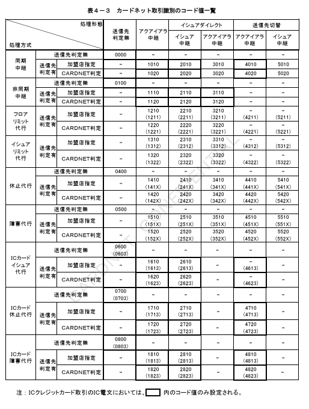
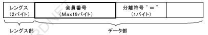
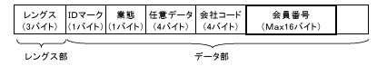

# 第４章　電文項目説明

本章では、ICクレジットカード取引において変更される電文の各項目について、項目内容を定義する。

## ４．１．業務共通ヘッダー

業務共通ヘッダーでは、以下の電文フィールドが変更される。

1．電文種別コード
2．カードネット取引識別

### ４．１．１．電文種別コード

①データ定義

| データ項目名 | 内容 | 属性／桁数 |
|---|---|---|
| 電文種別コード | CN手順の電文識別情報 | JIS8、an4、4バイト |

②本手順での規定

電文種別を識別するコード。上1桁目の「C」と「Q」は、CN手順で規定した電文を示す。

表４－１　電文種別コード一覧

| コード値 | 業務名 | 種別 |
|---|---|---|
| C100 | オーソリ | 要求 |
| C110 | オーソリ | 応答 |
| C120（C121） | オーソリアドバイス | 要求 |
| C130 | オーソリアドバイス | 応答 |
| C200 | 売上 | 要求 |
| C210 | 売上 | 応答 |
| C220（C221） | 売上アドバイス | 要求 |
| C230 | 売上アドバイス | 応答 |
| Q100 | オーソリ（ARQC） | 要求 |
| Q110 | オーソリ（ARQC） | 応答 |
| Q420（Q421）／C420（C421） | 障害取消アドバイス | 要求 |
| Q430／C430 | 障害取消アドバイス | 応答 |

注：Q420（Q421）は、取消対象取引がオーソリ（ARQC）の場合のみ使用される。

### ４．１．２．カードネット取引識別

ICクレジットカード取引により、X₂の「6～8」およびX₄の「3」が追加される。

①データ定義

| データ項目名 | 内容 | 属性／桁数 |
|---|---|---|
| カードネット取引識別 | CARDNETセンターの処理識別情報 | BCD、n4、2バイト |

②本手順での規定

CARDNETセンターの処理内容（電文中継処理、各種代行処理等）を識別するコードとして処理識別と処理方式の組み合わせによる4桁のコード値が設定される。カード会社にてCARDNETセンターの各種代行サービスを利用する場合は、上記コード値の識別が必要になる。

【図】表４－２　カードネット取引識別・コード体系

注1：オーソリ（ARQC）に対しては代行結果通知を送信しないため、X₂の「7」および「8」は、被仕向センターへの電文は設定されない。

注2：AC検証実施後、TVR／CVRマトリクス判定を実施しないため再中継の場合およびTVR／CVRマトリクス判定結果＝ARQCの場合に設定される。

---

## ４．２．BODY部

BODY部では、以下の電文フィールドが変更、追加される。

1．BIT 2：会員番号
2．BIT12：現地取引日時
3．BIT17：収録日
4．BIT18：商品コード
5．BIT22：POSデータコード
6．BIT35：JISⅠ第2トラック情報
7．BIT38：承認コード
8．BIT47：JISⅡトラック情報
9．BIT55：ICカード関連データ
10．BIT58：オーソリ判定センターID

### ４．２．１．BIT2：会員番号

①データ定義

| BIT | データ項目名 | 内容 | 属性／桁数 |
|---|---|---|---|
| 2 | 会員番号 | カード会員のカード番号 | JIS8、n..19、Max21バイト、LLVAR |

②本手順での規定

a）ICチップ読み込み時（JISⅠ相当）

BIT35（JISⅠ第2トラック情報）のレングス部に続く、データ部先頭バイトからが第符号の前まで最大19バイトを会員番号として設定する。
JISⅠ国内フォーマット（データ部の先頭バイトから"9392"で始まるカードフォーマット）の場合も、同様に設定する。

【図】図４－１　JISⅠ第2トラック情報（BIT35）

b）ICチップ読み込み時（JISⅡ相当）

BIT47（JISⅡトラック情報）のデータ部11桁目から26桁目までの16バイトを会員番号として設定する。
ただし、会員番号エリアにスペースが存在する場合には、最初の数字から連続した最後の数字までの最大16バイトを会員番号として設定する。
なお、JISⅡトラック情報は、「D／Smart」のみ設定可能。

【図】図４－２　JISⅡトラック情報（BIT47）

### ４．２．２．BIT12：現地取引日時

①データ定義

| BIT | データ項目名 | 内容 | 属性／桁数 |
|---|---|---|---|
| 12 | 現地取引日時 | 仕向センターのシステム日時 | JIS8、n12、12バイト |

②本手順での規定

取引特定キー（トランザクションID）の1項目として使用され、要求・応答・再送・結果通知といった一連の取引を通して、フィールド値は変化しない。

a）ICクレジットカード対応オンライン端末でのICクレジットカード取引

・同期中継電文：CARDNETセンターのシステム日時を設定する
・障害取消電文：CARDNETセンターのシステム日時を設定する
・非同期中継電文（障害取消電文以外）：取引が行われた日時を設定する（端末に保存する時刻に基づき、売上票に印字された日時）

b）センター間のICクレジットカード取引

・同期中継電文：仕向センターのシステム日時を設定する
・障害取消電文：仕向センターのシステム日時を設定する
・非同期中継電文（障害取消電文以外）：取引が行われた日時を設定する

### ４．２．３．BIT17：収録日

①データ定義

| BIT | データ項目名 | 内容 | 属性／桁数 |
|---|---|---|---|
| 17 | 収録日 | 取引売上日 | JIS8、n4、4バイト |

②本手順での規定

売上業務において、取引の売上情報としてカードが使用された日（会員控えの印字日）を設定する。MMDDの形式とする。

＜補足説明＞

ICオーソリアドバイス要求／IC売上アドバイス要求においては、以下のとおり設定する。

a）ICクレジットカード対応オンライン端末でのICクレジットカード取引
　取引の売上情報としてカードが使用された日

b）センター間のICクレジットカード取引
　原則として、上記ICクレジットカード対応オンライン端末の規定に従い設定する。
　ただし、仕向センターにて規定以外の設定方法を希望する場合は、カード会社と協議の上、設定方法を決定するものとする。

イシュアダイレクト処理時、およびオーソリ代行処理時は、CARDNETセンターにて当該項目を編集する。仕様詳細については「CARDNET接続条件書（代行機能編）」を参照。

### ４．２．４．BIT18：商品コード

①データ定義

| BIT | データ項目名 | 内容 | 属性／桁数 |
|---|---|---|---|
| 18 | 商品コード | 商品コード | JIS8、n4、4バイト |

②本手順での規定

オーソリ、売上業務において、入力された商品コードを設定する。
商品コード一覧は、「CARDNET接続条件書（ダイレクト接続編）」を参照。

＜補足説明＞

ICクレジットカード対応オンライン端末においては、以下のとおり設定する。

【IC電文】
①商品コードの設定がなかった場合、オンライン端末にて端末IC情報管理レコードに登録されている商品コードを設定する。
※商品コードには、オール0の登録も可能。

【MS電文】
①商品コードの設定が無かった場合（オール0入力含む）、かつCARDNETセンターに加盟店ブランド情報テーブルが登録されている場合は、CARDNETセンターにて加盟店ブランド情報テーブルに登録されている該当ブランドの商品コードを設定する。
②商品コードがオール0を入力した場合、かつCARDNETセンターに加盟店ブランド情報テーブルが登録されていない場合は、CARDNETセンターにて0990を設定する。
※商品コードには、オール0の登録も可能。

「加盟店ブランド情報テーブル」および「端末IC情報管理レコード」の詳細については、「CARDNET端末情報登録仕様書」を参照。

### ４．２．５．BIT22：POSデータコード

①データ定義

| BIT | データ項目名 | 内容 | 属性／桁数 |
|---|---|---|---|
| 22 | POSデータコード | カード区分、PIN入力有無 | JIS8、an12、12バイト |

②本手順での規定

端末の能力、環境、カードの使用方法等を識別するコードが設定される。
コード値の詳細は、「CARDNET接続条件書（ダイレクト接続編）」を参照。

＜注意事項＞

BIT55（ICカード関連データ）が設定されている電文については、BIT22の7桁目に"5"または"A"または"B"以外の値を設定した場合、CARDNETセンターにて拒否応答する。（国内レスポンスコード：P90）

### ４．２．６．BIT35：JISⅠ第2トラック情報

①データ定義

| BIT | データ項目名 | 内容 | 属性／桁数 |
|---|---|---|---|
| 35 | JISⅠ第2トラック情報 | JISⅠ第2トラック（ABA）データ／JISⅠ第2トラック（国内専用）データ | JIS8、ans..37、Max39バイト、LLVAR |

②本手順での規定

ICチップ入力時は、ICチップ内の「Track 2 Equivalent Data」（Tag "57"）が設定される。

### ４．２．７．BIT38：承認コード

①データ定義

| BIT | データ項目名 | 内容 | 属性／桁数 |
|---|---|---|---|
| 38 | 承認コード | 承認コード | JIS8、anp6、6バイト |

②本手順での規定

ICオーソリアドバイス要求／IC売上アドバイス要求においては、以下のとおり設定する。

a）ICクレジットカード対応オンライン端末でのICクレジットカード取引

オフライン許可：ALL"0"
オフライン拒否：ALL"0"
オンライン許可：オーソリ（ARQC）応答電文に設定された承認番号
　　　　　　　但し、最終取引結果が拒否の場合はALL"0"
オンライン拒否：ALL"0"

b）センター間のICクレジットカード取引

原則として、上記ICクレジットカード対応オンライン端末の規定に従い設定する。
ただし、仕向センターにて規定以外の設定方法を希望する場合は、カード会社と協議の上、設定方法を決定するものとする。

### ４．２．８．BIT47：JISⅡトラック情報

①データ定義

| BIT | データ項目名 | 内容 | 属性／桁数 |
|---|---|---|---|
| 47 | JISⅡトラック情報 | JISⅡトラックデータ | JIS8、ans69、72バイト、LLVAR |

②本手順での規定

「D／Smart」のみ設定可能。
ICチップ入力時は、ICチップ内の "JIS2 Equivalent Data"（Tag "DF4F"）が設定される。

### ４．２．９．BIT55：ICカード関連データ

①データ定義

| BIT | データ項目名 | 内容 | 属性／桁数 |
|---|---|---|---|
| 55 | ICカード関連データ | ICクレジットカードを使用した取引の追加情報 | Binary、b..204、Max258バイト、LLVAR |

②本手順での規定

ICクレジットカードを使用したオーソリ（ARQC）要求電文（MTI 1100/1110）、ICオーソリアドバイス要求電文（MTI 1120（1121））、IC売上アドバイス要求電文（MTI 1220（1221））において、本データを設定する。なお、BIT55を設定する電文でBIT22のPOSデータコードの7桁目に"5"または"A"または"B"以外の値を設定した場合は、CARDNETセンターにて拒否応答する。（国内レスポンスコード：P90）

本フィールドには、各クレジットカードブランドが指定するICカード関連データをTLV形式のデータ要素に格納する。本フィールドに含まれるべきデータは各ブランド毎に規定され、規定外のデータや属性、長さを設定することはできない。

各ブランド毎のICカード関連データの設定項目および内容の詳細については、「CARDNET　ICカード関連データ項目説明書」を参照。

また、オーソリ（ARQC）電文の本フィールドにおいて、要求電文および応答電文で、各ブランド共通で必須に設定すべきデータおよびその条件を、CARDNETセンターとして定める。

表４－４　要求電文における必須項目

| タグ | データ名 | 条件（長さ（バイト）） | 備考 |
|---|---|---|---|
| 4F | Application Identifier | 5以上16以内 | 注1 |
| 84 | Dedicated File Name | 5以上16以内 | 注1 |

注1：タグ"4F"とタグ"84"は少なくともどちらか一方は必須とする。両方設定されている場合、タグ"84"の内容を優先する。

注2：CARDNETセンターのICクレジット代行機能利用時の必須項目については、「CARDNET接続条件書（代行機能編）別冊ICクレジットカード拡張仕様」を参照。

表４－５　応答電文における必須項目

| タグ | データ名 | 条件（長さ（バイト）） | 備考 |
|---|---|---|---|
| 91 | Issuer Authentication Data | 16以内 | 注1 |
| 8A | Authorization Response Code | 2固定 | 注1 |

注1：タグ"91"またはタグ"8A"は、少なくともどちらか一方は設定必須とする。また、タグ"91"および"8A"は同時に設定可能とし、同時に設定する場合は必ず"91"を先頭タグに設定し、2番目のタグに"8A"を設定する。（同時に設定された場合、CARDNETセンターおよびICクレジットカード対応オンライン端末ではタグ"8A"からARC値を取得する。）タグ"91"または"8A"のいずれか一方のみを設定する場合には、必ず先頭タグとして設定する。なお、被仕向センターからのオーソリ（ARQC）応答電文のICカード関連データ（BIT55）にタグ"8A"が設定されていない場合、CARDNETセンターにてアクションコードに基づきタグ"8A"を生成し、ICクレジットカード対応オンライン端末または仕向センターへ応答する。（表５－１～表５－６参照）

注2：ICクレジットカード対応オンライン端末または仕向センターからのオーソリ（ARQC）応答電文のICカード関連データ（BIT55）中に設定されたタグのうち、"91"、"8A"、"71"、"72"のみを対象とし、その他のタグの詳細については、「CARDNET　ICカード関連データ項目説明書」を参照。

### ４．２．１０．BIT58：オーソリ判定センターID

①データ定義

| BIT | データ項目名 | 内容 | 属性／桁数 |
|---|---|---|---|
| 58 | オーソリ判定会社センターID | オーソリゼーション判定を行ったセンターを識別するコード | JIS8、an11、13バイト、LLVAR |

②本手順での規定

ICオーソリアドバイス要求／IC売上アドバイス要求においては、以下のとおり設定する。

・ICクレジットカード対応オンライン端末でのICクレジットカード取引

オフライン許可：ALL"スペース"
オフライン拒否：ALL"スペース"
オンライン許可：オーソリ（ARQC）応答電文に設定されたオーソリ判定会社コード
　　　　　　　（最終取引結果が拒否の場合も同様）
オンライン拒否：オーソリ（ARQC）応答電文に設定されたオーソリ判定会社コード
　　　　　　　または、ALL"スペース"

・センター間のICクレジットカード取引

原則として、上記ICクレジットカード対応オンライン端末の規定に従い設定する。
ただし、仕向センターにて規定以外の設定方法を希望する場合は、カード会社と協議の上、設定方法を決定するものとする。
