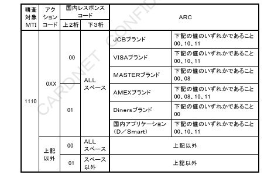
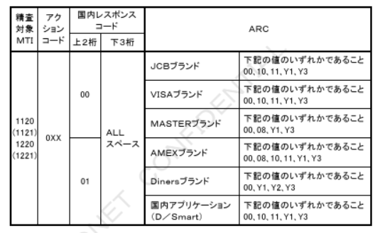

# 第５章　各種識別仕様

本章では、ICクレジットカード取引により変更、追加されるエラーコードの設定基準および対応表について定義する。

## ５．１　エラーコード設定基準

CN手順におけるICクレジットカード取引結果の識別は、BODY部のアクションコード（BIT39）を基本とする。またアクションコードの補足情報として、BODY部の国内レスポンスコード（BIT48）を使用する。

ただしICクレジットカードは、オーソリ（ARQC）の応答結果をICカード関連データ（BIT55）・ARC（Authorization Response Code）のコード値により判断する。

本章では、ICクレジットカード取引により追加されたICカード関連データ・ARCの設定基準のみを掲載する。

アクションコード、および国内レスポンスコードの設定基準については、「CARDNET接続条件書（ダイレクト接続編）」を参照。

### ５．１．１　アクションコードからARCへの変換仕様

ICクレジットカード未対応カード会社センターに対して、オーソリ（ARQC）電文はオーソリ電文に変換した上で中継する。
オーソリ応答電文には、BODY部のICカード関連データ（BIT55）を付与することができないため、CARDNETセンターにてICカード関連データ（BIT39）からICカード関連データ（BIT55）・ARCへの変換を行う。

ブランド毎のICカード関連データ（BIT55）・ARCの対応表を以下に示す。

表5-1　アクションコードとICカード関連データ（BIT55）・ARC対応表（JCBブランド用）

| アクションコード |  | ICカード関連データ・ARC |  |
|---|---|---|---|
| コード値 | 内容 | コード値 | 内容 |
| 00  | 承認許可                         | 00 | Approved or completed successfully |
| 100 | 取扱拒否                         | 05 | Do not honour |
| 103 | 取扱保留、アクワイアラへ連絡     | 01 | Refer to card issuer |
| 200 | カード回収、アクワイアラへ連絡   | 04 | Pick-up |
| 909 | 障害中（システム不調）           | 91 | Issuer or switch is inoperative |
| その他 | ―                              | 05 | Do not honour |

---

表5-2　アクションコードとICカード関連データ（BIT55）・ARC対応表（VISAブランド用）

| アクションコード |  | ICカード関連データ・ARC |  |
|---|---|---|---|
| コード値 | 内容 | コード値 | 内容 |
| 000 | 承認許可                         | 00 | Approved or completed successfully |
| 100 | 取扱拒否                         | 05 | Do not honour |
| 103 | 取扱保留、アクワイアラへ連絡     | 01 | Refer to card issuer |
| 200 | カード回収、アクワイアラへ連絡   | 04 | Pick-up |
| 909 | 障害中（システム不調）           | 91 | Issuer or switch is inoperative |
| その他 | ―                              | 05 | Do not honour |

---

表5-3　アクションコードとICカード関連データ（BIT55）・ARC対応表（MASTERブランド用）

| アクションコード |  | ICカード関連データ・ARC |  |
|---|---|---|---|
| コード値 | 内容 | コード値 | 内容 |
| 000 | 承認許可                         | 00 | Approved or completed successfully |
| 100 | 取扱拒否                         | 05 | Do not honour |
| 103 | 取扱保留、アクワイアラへ連絡     | 01 | Refer to card issuer |
| 200 | カード回収、アクワイアラへ連絡   | 04 | Pick-up |
| 909 | 障害中（システム不調）           | 91 | Issuer or switch is inoperative |
| その他 | ―                              | 05 | Do not honour |

（注）ICクレジットカード対応オンライン端末へは、ARC値を「05」に変換して応答する。

---

表5-4　アクションコードとICカード関連データ（BIT55）・ARC対応表（AMEXブランド用）

| アクションコード |  | ICカード関連データ・ARC |  |
|---|---|---|---|
| コード値 | 内容 | コード値 | 内容 |
| 000 | 承認許可                         | 00 | Approved or completed successfully |
| 100 | 取扱拒否                         | 05 | Do not honour |
| 103 | 取扱保留、アクワイアラへ連絡     | 01 | Refer to card issuer |
| 200 | カード回収、アクワイアラへ連絡   | 04 | Pick-up |
| 909 | 障害中（システム不調）           | 91 | Issuer or switch is inoperative |
| その他 | ―                              | 05 | Do not honour |

---

表5-5　アクションコードとICカード関連データ（BIT55）・ARC対応表（Dinersブランド用）

| アクションコード |  | ICカード関連データ・ARC |  |
|---|---|---|---|
| コード値 | 内容 | コード値 | 内容 |
| 000 | 承認許可                         | 00 | Online Approved |
| 100 | 取扱拒否                         | 10 | Online Declined |
| 103 | 取扱保留、アクワイアラへ連絡     | 01 | Referral requested by the issuer |
| 200 | カード回収、アクワイアラへ連絡   | 11 | Capture the Card |
| 909 | 障害中（システム不調）           | 10 | Online Declined |
| その他 | ―                              | 10 | Online Declined |

---

表5-6　アクションコードとICカード関連データ（BIT55）・ARC対応表（国内アプリケーション（D／Smart）用）

| アクションコード |  | ICカード関連データ・ARC |  |
|---|---|---|---|
| コード値 | 内容 | コード値 | 内容 |
| 000 | 承認許可                         | 00 | Approved or completed successfully |
| 100 | 取扱拒否                         | 05 | Do not honour |
| 103 | 取扱保留、アクワイアラへ連絡     | 01 | Refer to card issuer |
| 200 | カード回収、アクワイアラへ連絡   | 04 | Pick-up |
| 909 | 障害中（システム不調）           | 91 | Issuer or switch is inoperative |
| その他 | ―                              | 05 | Do not honour |

### ５．１．２　ARC関連審査

ICカード関連データ・ARCは、ICクレジットカード取引における被仕向センターの判定結果として、ICクレジットカード対応オンライン端末または仕向センターに対するオーソリ（ARQC）応答電文に設定する。

また、ICオーソリアドバイスおよびIC売上アドバイス要求電文には、オーソリ（ARQC）応答電文中のARCをそのまま設定する。また、オフラインでの取引完了時には、ICクレジットカード対応オンライン端末または仕向センターにてARCを設定する。

CARDNETセンターは、ICカード関連データ中のARCに関し、以下の精査を行う。

（1）オーソリ（ARQC）応答電文精査

CARDNETセンターは、被仕向センターからのオーソリ（ARQC）応答電文のアクションコード（BIT39）および国内レスポンスコード（BIT48）とICカード関連データ（BIT55）中のARCの関連精査を行う。精査エラー時、CARDNETセンターは、被仕向センターに対して障害電文を通知する。各ブランド毎の精査条件を表5－7に示す。

表5－7　ARC関連精査条件①

【図】表5－7　ARC関連精査条件①

注1：被仕向センターからのオーソリ（ARQC）応答電文のICカード関連データ（BIT55）中にタグ"91"とタグ"8A"の両方が設定されている場合、タグ"8A"の値にて上記の精査を実施する。

注2：被仕向センターからのオーソリ（ARQC）応答電文のICカード関連データ（BIT55）中にタグ"8A"が設定されていない場合、上記の精査は行わない。

（2）アドバイス要求電文精査

CARDNETセンターは、ICクレジットカード対応オンライン端末または仕向センターからのアドバイス要求電文のBIT55がBIT ONの時、アクションコード（BIT39）および国内レスポンスコード（BIT48）とICカード関連データ（BIT55）中のARCの関連精査を行う。

精査エラー時、CARDNETセンターは仕向センターに対し拒否応答電文を送信する。ICクレジットカード対応オンライン端末に対してはエラー応答電文を送信する。各ブランド毎の精査条件を表5－8に示す。

表5－8　ARC関連精査条件②

【図】表5－8　ARC関連精査条件②

※アクションコードが「0XX」以外の場合、ARCとの関連精査は行わない。
