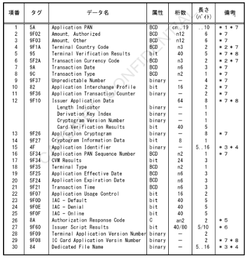
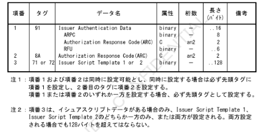
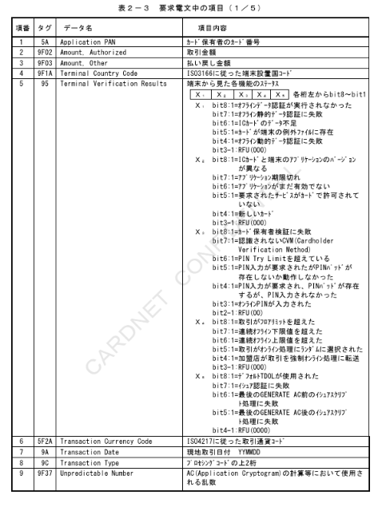
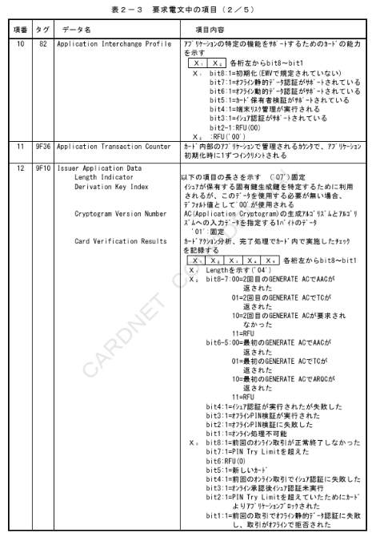
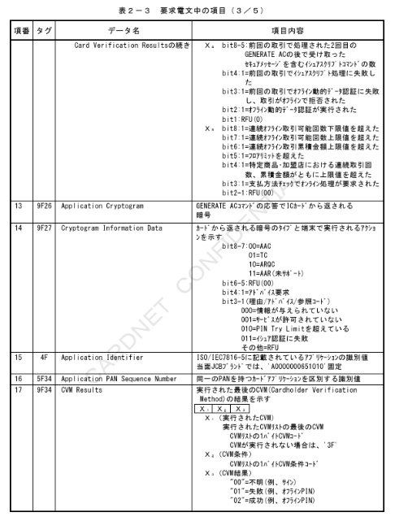
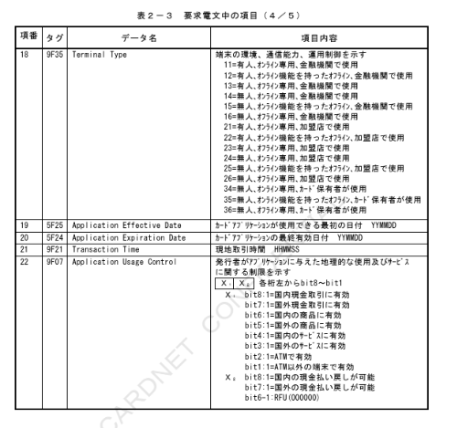
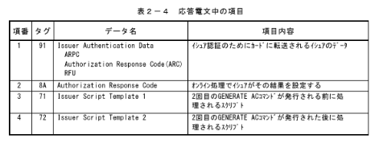
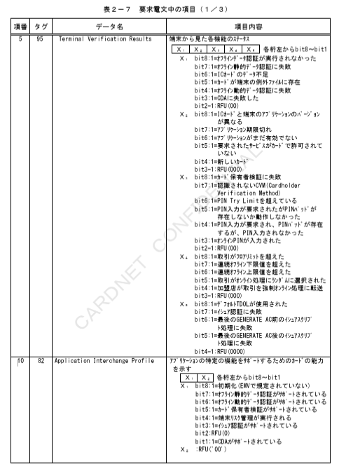
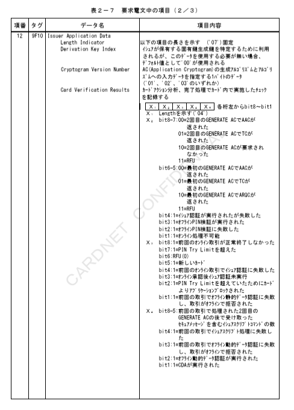
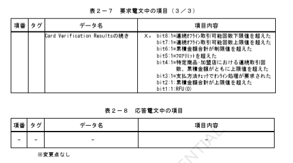

# 第２章　ＪＣＢブランド用

本章では、ＪＣＢブランド用のＩＣカード関連データの項目について、「ジェーシービーＩＣカードシステム仕様書」に基づき、設定項目および内容を説明する。

## ２．１　ＪＣＢブランド用ＩＣカード関連データ設定内容（J/Smart）

### ２．１．１　J/Smart1.2

ＪＣＢブランド用のＩＣカード関連データ（J/Smart1.2）の設定項目について表２－１および表２－２に、設定内容について表２－３および表２－４に示す。

表２－１　ＩＣ処理の各種要求電文における設定項目（ＪＣＢブランド用：J/Smart1.2）

【図】表２－１　ＩＣ処理の各種要求電文における設定項目

※1　左詰めにてカード番号を設定。桁数が奇数の時など、残りの桁のパディングが必要な場合は、4bitを「F」で埋める。
※2　右詰め、左4bitを「0」とする。
※3　本書での表記上、以降HEX文字（0～F）にて表現する。
※4　タグ「4F」とタグ「84」は少なくともどちらか一方は必須とする。両方設定されている場合、タグ「84」の内容を優先する。
※5　アドバイス要求電文の場合含まれる。
※6　イシュアスクリプト処理実行後のアドバイス要求電文のみ含まれる。
※7　Issuer Script Templateが1つの場合は桁数：40、2つの場合は桁数：80となる。
※8　CARDNETセンターにてTVR／CVRマトリクス判定が未実施時は必須項目とする。

---

表２－２　オーソリ（ARQC）の応答電文における設定項目（JCBブランド用：J/Smart1.2）

【図】表２－２　オーソリ（ARQC）の応答電文における設定項目

### ２．１．２　J/Smart2.0

JCBブランド用のICカード関連データ「J/Smart2.0」における「J/Smart1.2」からの変更点について、設定項目を表2－5および表2－6に、設定内容を表2－7から表2－8に示す。

表2－5　IC処理の各種要求電文における設定項目（JCBブランド用：J/Smart2.0）

|項番|タグ|データ名|属性|桁数|長さ（バイト）|備考|
|---|---|---|---|---|---|---|
|-|-|-|-|-|-|-|

※変更点なし

表2－6　オーソリ（ARQC）の応答電文における設定項目（JCBブランド用：J/Smart2.0）

|項番|タグ|データ名|属性|桁数|長さ（バイト）|備考|
|---|---|---|---|---|---|---|
|-|-|-|-|-|-|-|

※変更点なし

