# 第３章　ＶＩＳＡブランド用

本章では、ＶＩＳＡブランド用のＩＣカード関連データの項目について、設定項目および内容を説明する。

## ３．１　ＶＩＳＡブランド用ＩＣカード関連データ設定内容（VSDC1.3.2/VSDC1.4）

### ３．１．１　VSDC1.3.2

ＶＩＳＡブランド用のＩＣカード関連データ（VSDC1.3.2）の設定項目について表３－１および表３－２に、設定内容について表３－３および表３－４に示す。

表３－１　ＩＣ処理の各種要求電文における設定項目（ＶＩＳＡブランド用：VSDC1.3.2）

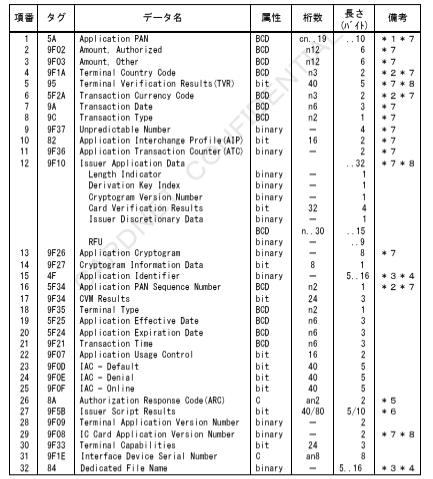

＊１　左詰めにてカード番号を設定。桁数が奇数の時など、残りの桁のパディングが必要な場合は、４ｂｉｔで０１１１埋め。
＊２　右詰め、左４ｂｉｔ＝００００埋め。
＊３　本書での桁数は、以降ＨＥＸ文字（０～Ｆ）にて表現する。
＊４　タグＡＥにタグ８４は必ずしもカードから取得したものとは限らない。
　　両方設定されている場合、タグ８４の内容を優先する。
＊５　アドレス数の最大値が含まれる。
＊６　インデックス切り取り連番情報のアドレス変換数に含まれる。
＊７　Issuer Script Template1が１０の場合は桁数：４０、２２の場合は桁数：８０となる。
＊８　CARDNETセンターにてＡＣ機能代行実施時は必須項目とする。
＊９　CARDNETセンターにてＴＶＲ／ＣＶＲマトリクス相関代行実施時は必須項目とする。

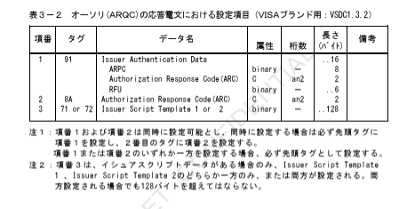

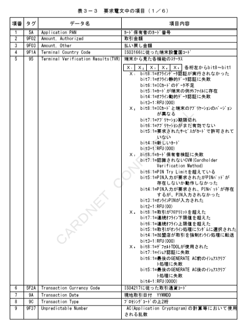

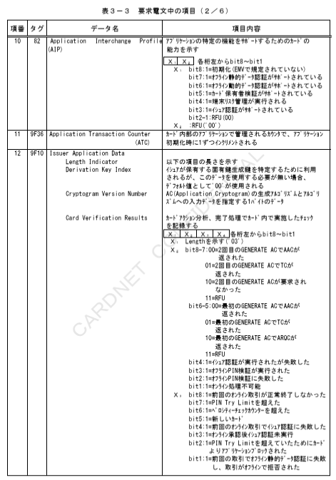

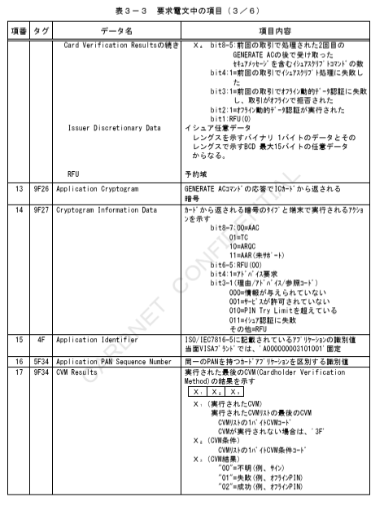

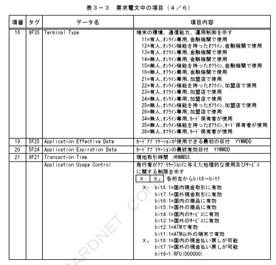

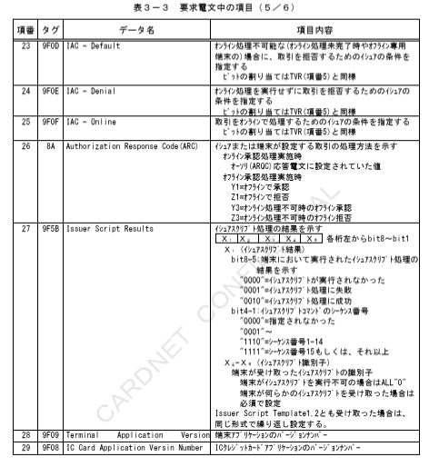

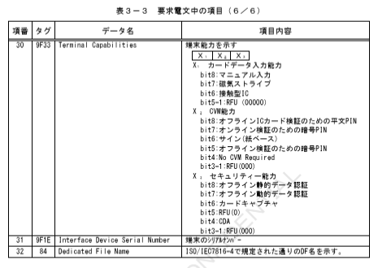

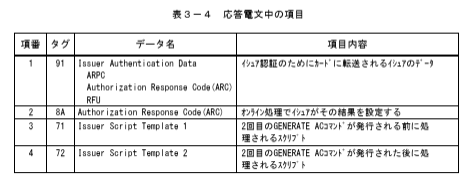

### ３．１．２　VSDC1.4

ＶＩＳＡブランド用のＩＣカード関連データ（VSDC1.4）におけるVSDC1.3.2からの変更点について、設定項目を表３－５および表３－６に、設定内容を表３－７および表３－８に示す。

表３－５　ＩＣ処理の各種要求電文における設定項目（ＶＩＳＡブランド用：VSDC1.4）

|項番|タグ|データ名|属性|桁数|長さ（バイト）|備考|
|---|---|---|---|---|---|---|
|-|-|-|-|-|-|-|

※変更点なし

表３－６　オーソリ（ARQC）の応答電文における設定項目（ＶＩＳＡブランド用：VSDC1.4）

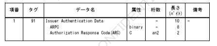

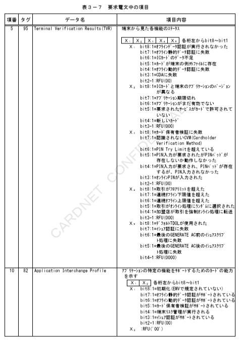
