# 第４章　ＭＡＳＴＥＲブランド用

本章では、ＭＡＳＴＥＲブランド用のＩＣカード関連データの項目について、設定項目および内容を説明する。

## ４．１　ＭＡＳＴＥＲブランド用ＩＣカード関連データ設定内容（M/Chip）

### ４．１．１　M/Chip2.1

ＭＡＳＴＥＲブランド用のＩＣカード関連データ（M/Chip2.1）の設定項目について表４－１および表４－２に、内容について表４－３および表４－４に示す。

表４－１　ＩＣ処理の各種要求電文における設定項目（ＭＡＳＴＥＲブランド用：M/Chip2.1）

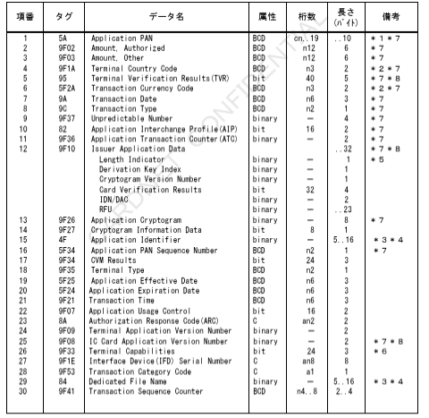

＊１　左詰めにてカード番号を設定。桁数が奇数の時など、残りの桁のパディングが必要な場合は、４ｂｉｔで「１１１１」埋め。
＊２　右詰め、左４ｂｉｔ＝「００００」埋め。
＊３　本書での桁数は、以降ＨＥＸ文字（０～Ｆ）にて表現する。
＊４　タグＡＥにタグ８４は必ずしもどちらか一方は必須とする。
　　両方設定されている場合、タグ８４の内容を優先する。
＊５　Length Indicatorは設定されている値が含まれる。
＊６　アドレス変換数にのみ含まれる。
＊７　CARDNETセンターにてＡＣ機能代行実施時は必須項目とする。
＊８　CARDNETセンターにてＴＶＲ／ＣＶＲマトリクス判定代行実施時は必須項目とする。

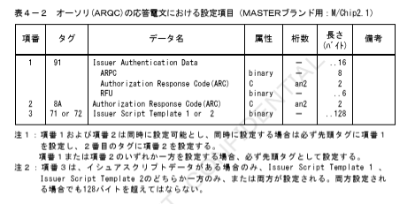

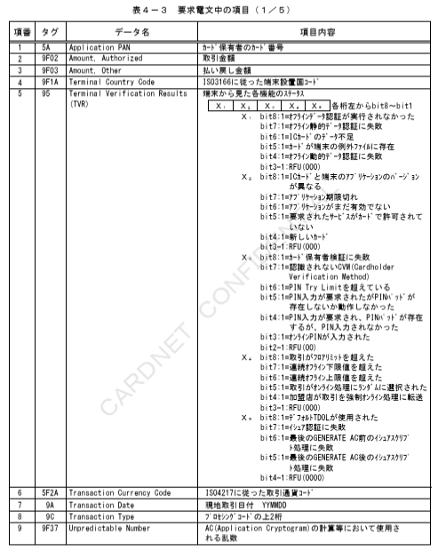

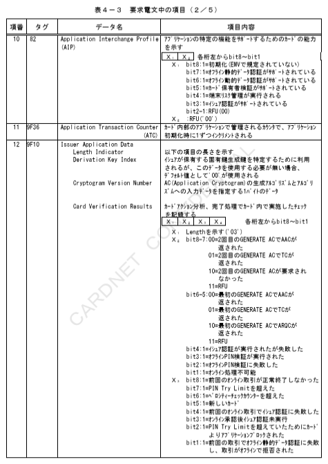

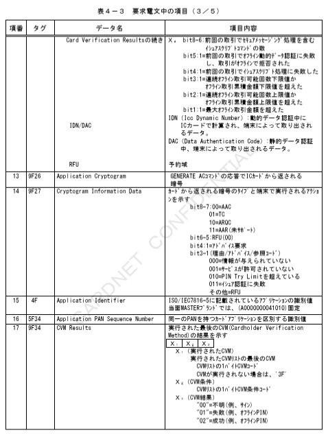

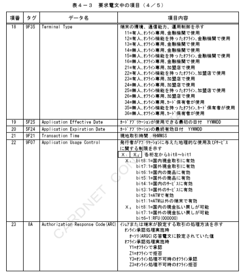

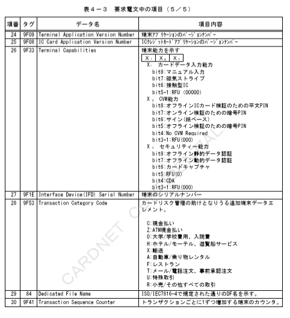

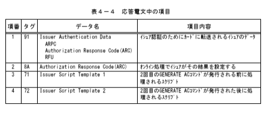

### ４．１．２　M/Chip4.0

ＭＡＳＴＥＲブランド用のＩＣカード関連データ（M/Chip4.0）におけるM/Chip2.0からの変更点について、設定項目を表４－５および表４－６に、内容について表４－７および表４－８に示す。

表４－５　ＩＣ処理の各種要求電文における設定項目（ＭＡＳＴＥＲブランド用：M/Chip4.0）

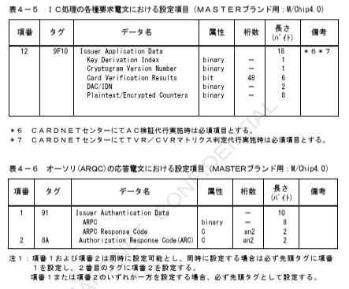

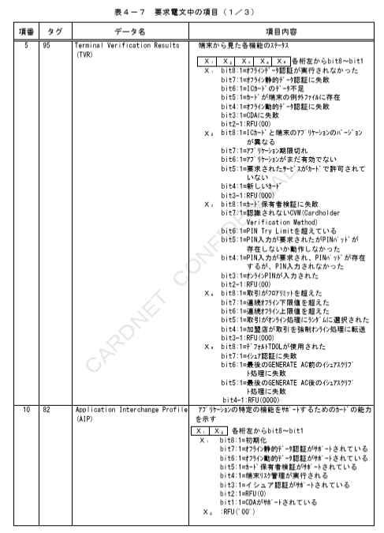

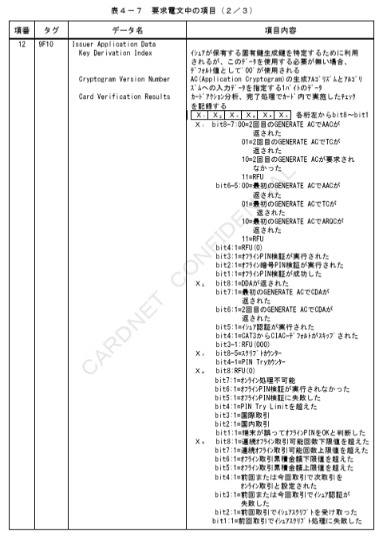

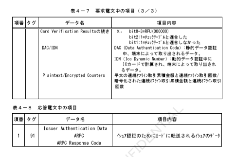
