# 第５章　ＡＭＥＸブランド用

本章では、ＡＭＥＸブランド用のＩＣカード関連データの項目について、設定項目および内容を説明する。

## ５．１　ＡＭＥＸブランド用ＩＣカード関連データ設定内容（AEIPS）

### ５．１．１　AEIPS1.0

ＡＭＥＸブランド用のＩＣカード関連データ（AEIPS1.0）の設定項目について表５－１および表５－２に、設定内容について表５－３および表５－４に示す。

表５－１　ＩＣ処理の各種要求電文における設定項目（ＡＭＥＸブランド用：AEIPS1.0）

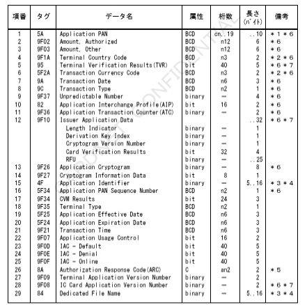

＊１　左詰めにてカード番号を設定。桁数が奇数の時など、残りの桁のパディングが必要な場合は、４ｂｉｔで「１１１１」埋め。
＊２　右詰め、左４ｂｉｔ＝「００００」埋め。
＊３　本書での桁数は、以降ＨＥＸ文字（０～Ｆ）にて表現する。
＊４　タグＡＥにタグ８４は少なくともどちらか一方は必須とする。
　　両方設定されている場合、タグ８４の内容を優先する。
＊５　アドレス変換数にのみ含まれる。
＊６　CARDNETセンターにてＡＣ機能代行実施時は必須項目とする。
＊７　CARDNETセンターにてＴＶＲ／ＣＶＲマトリクス判定代行実施時は必須項目とする。

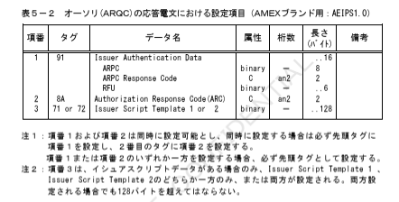

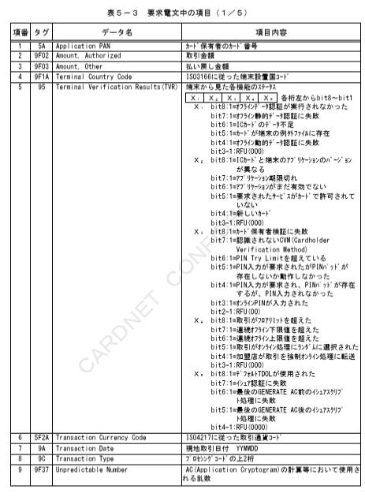

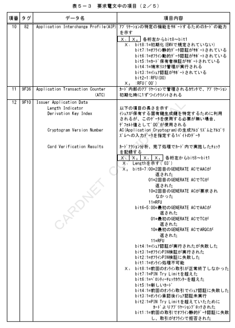

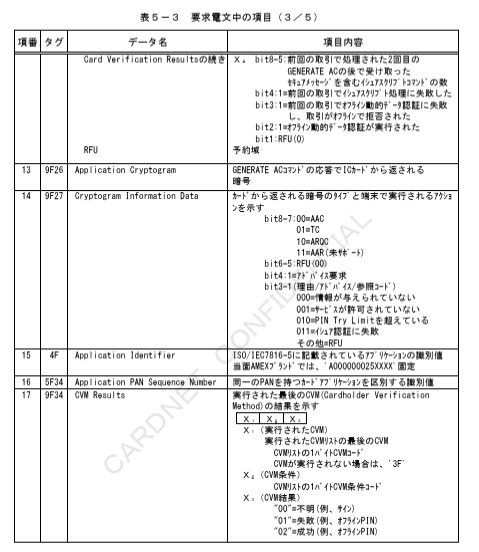

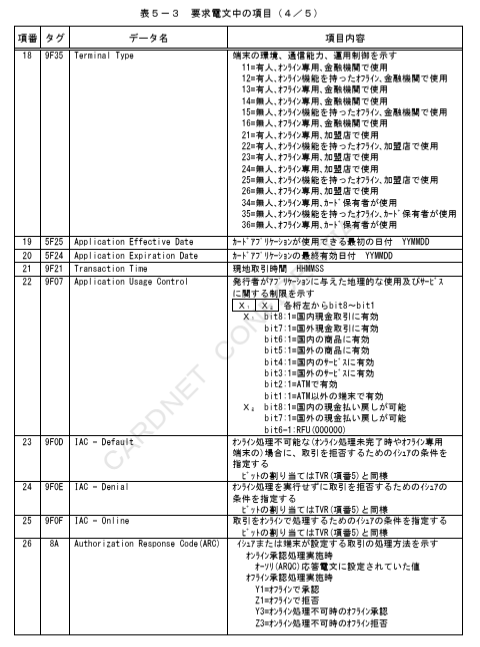

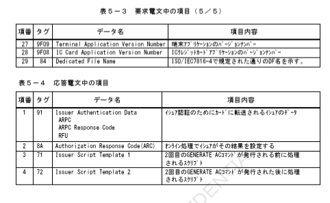

### ５．１．２　AEIPS4.0

ＡＭＥＸブランド用のＩＣカード関連データ「AEIPS4.0」における「AEIPS1.0」からの変更点について、設定項目を表５－５および表５－６に、設定内容を表５－７および表５－８に示す。

表５－５　ＩＣ処理の各種要求電文における設定項目（ＡＭＥＸブランド用：AEIPS4.0）

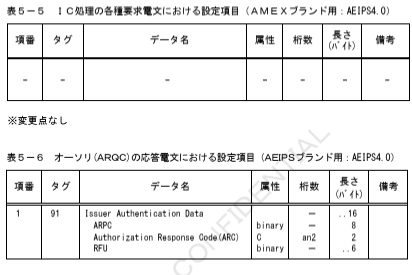

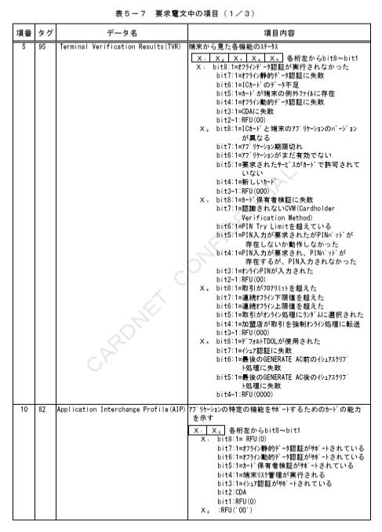

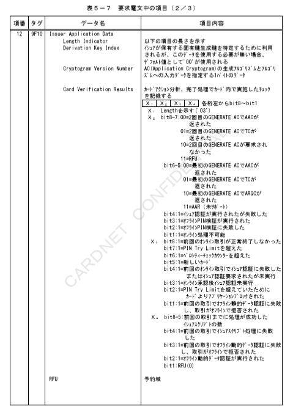

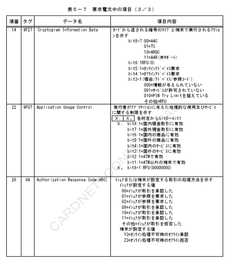

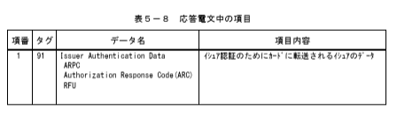
