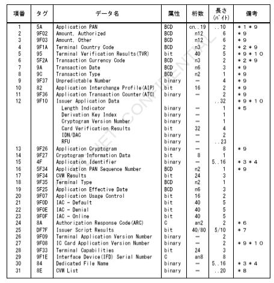
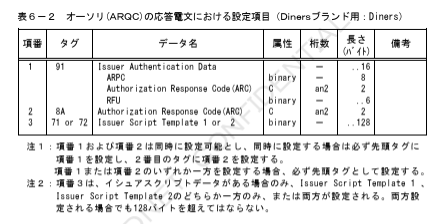
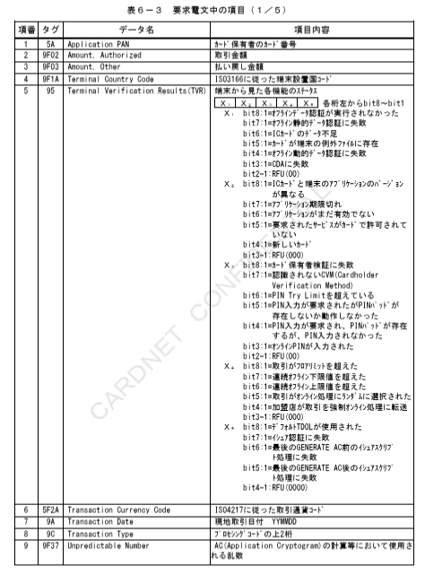
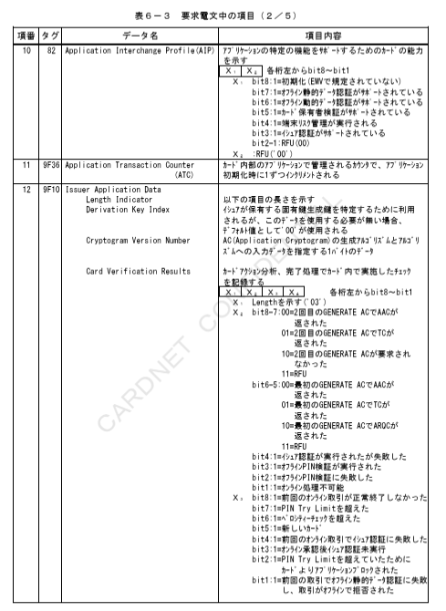
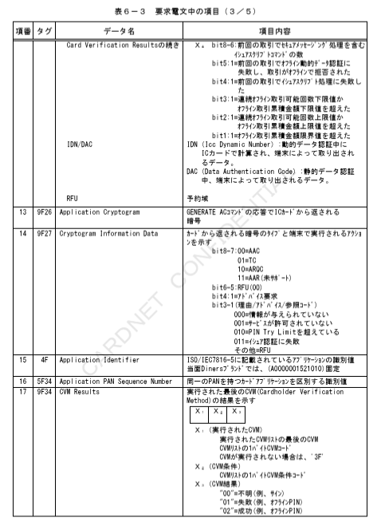
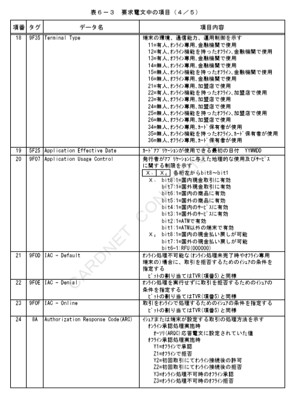
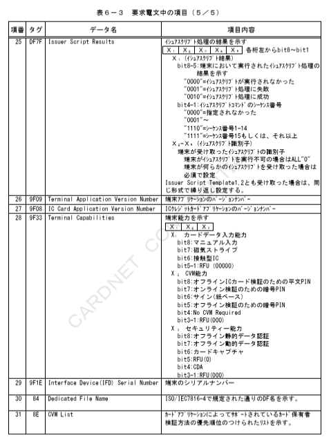
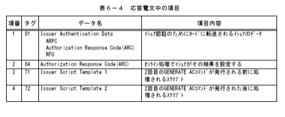

# 第６章　Ｄｉｎｅｒｓブランド用

本章では、Ｄｉｎｅｒｓブランド用のＩＣカード関連データの項目について、設定項目および内容を説明する。

## ６．１　Ｄｉｎｅｒｓブランド用ＩＣカード関連データ設定内容（Diners）

### ６．１．１　Diners

Ｄｉｎｅｒｓブランド用のＩＣカード関連データ（Diners）の設定項目について表６－１および表６－２に、内容について表６－３および表６－４に示す。

表６－１　ＩＣ処理の各種要求電文における設定項目（Ｄｉｎｅｒｓブランド用：Diners）

＊１　左詰めにてカード番号を設定。桁数が奇数の時など、残りの桁のパディングが必要な場合は、４ｂｉｔで「１１１１」埋め。
＊２　右詰め、左４ｂｉｔ＝「００００」埋め。
＊３　本書での桁数は、以降ＨＥＸ文字（０～Ｆ）にて表現する。
＊４　タグＡＥにタグ８４は少なくともどちらか一方は必須とする。
　　両方設定されている場合、タグ８４の内容を優先する。
＊５　Length Indicatorは設定されている値が含まれる。
＊６　アドレス変換数にのみ含まれる。
＊７　インデックス切り取り連番情報のアドレス変換数にのみ含まれる。
＊８　Issuer Script Template1の値が１０の場合は桁数：４０、２２の場合は桁数：８０となる。
＊９　ICカード内のデータが２０バイトを超える場合、先頭２０バイトまでを設定する。
＊１０　CARDNETセンターにてＴＶＲ／ＣＶＲマトリクス判定代行実施時は必須項目とする。

