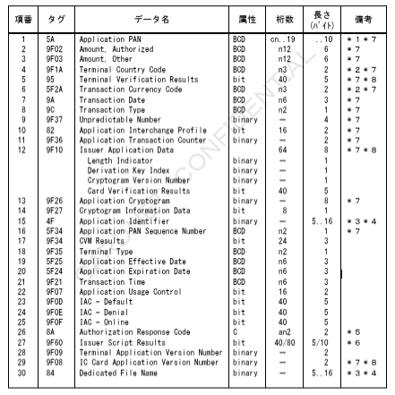
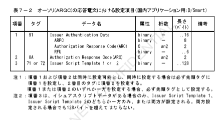
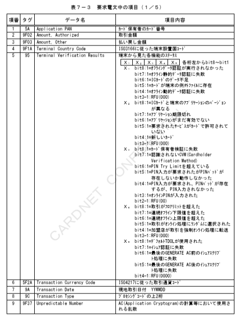
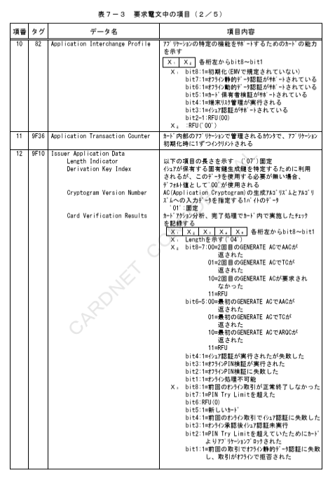
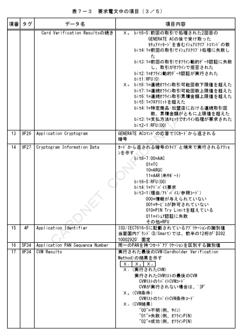
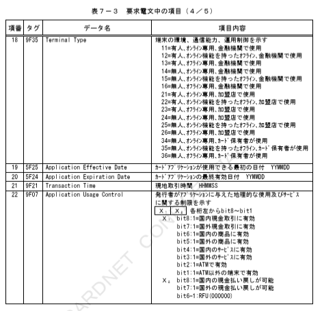
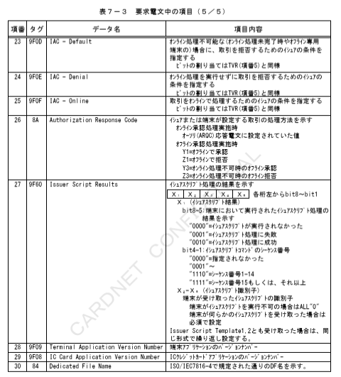
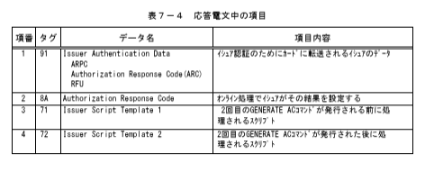

# 第７章　国内アプリケーション（D/Smart）用

本章では、国内アプリケーション（D/Smart）用のＩＣカード関連データの項目について、設定項目および内容を説明する。

## ７．１　国内アプリケーション（D/Smart）用ＩＣカード関連データ設定内容

国内アプリケーション（D/Smart）用のＩＣカード関連データの設定項目について表７－１および表７－２に、設定内容について表７－３および表７－４に示す。

表７－１　ＩＣ処理の各種要求電文における設定項目（国内アプリケーション用：D/Smart）

＊１　左詰めにてカード番号を設定。桁数が奇数の時など、残りの桁のパディングが必要な場合は、４ｂｉｔで「１１１１」埋め。
＊２　右詰め、左４ｂｉｔ＝「００００」埋め。
＊３　本書での桁数は、以降ＨＥＸ文字（０～Ｆ）にて表現する。
＊４　タグＡＥにタグ８４は少なくともどちらか一方は必須とする。
　　両方設定されている場合、タグ８４の内容を優先する。
＊５　アドレス変換数にのみ含まれる。
＊６　インデックス切り取り連番情報のアドレス変換数にのみ含まれる。
＊７　Issuer Script Template1の値が１０の場合は桁数：４０、２２の場合は桁数：８０となる。
＊８　CARDNETセンターにてＴＶＲ／ＣＶＲマトリクス判定代行実施時は必須項目とする。

