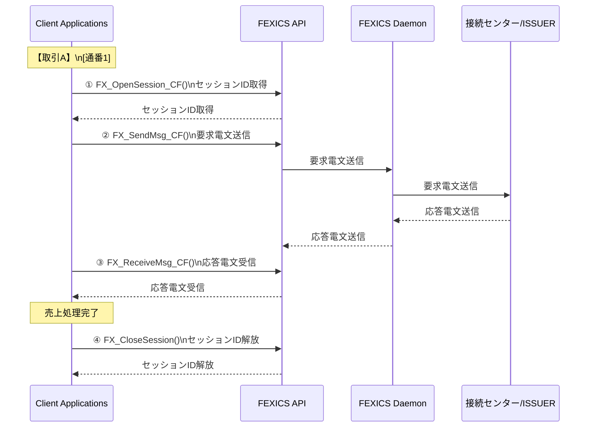
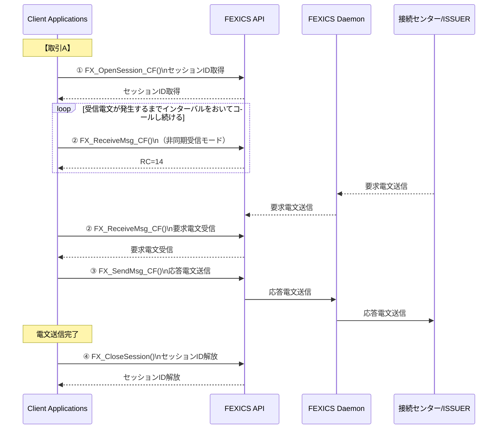
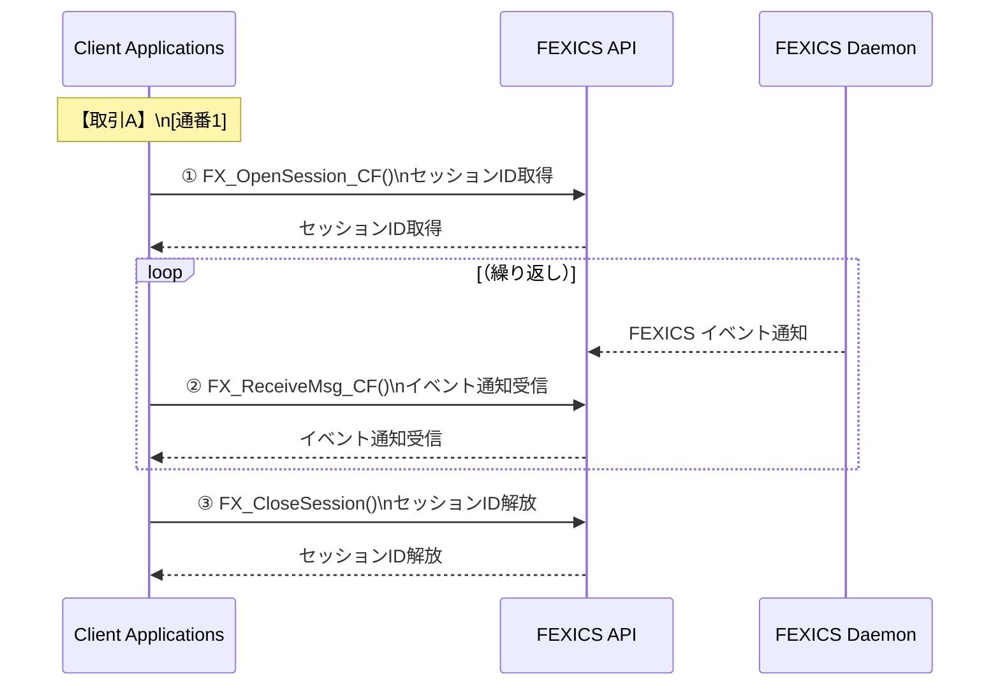
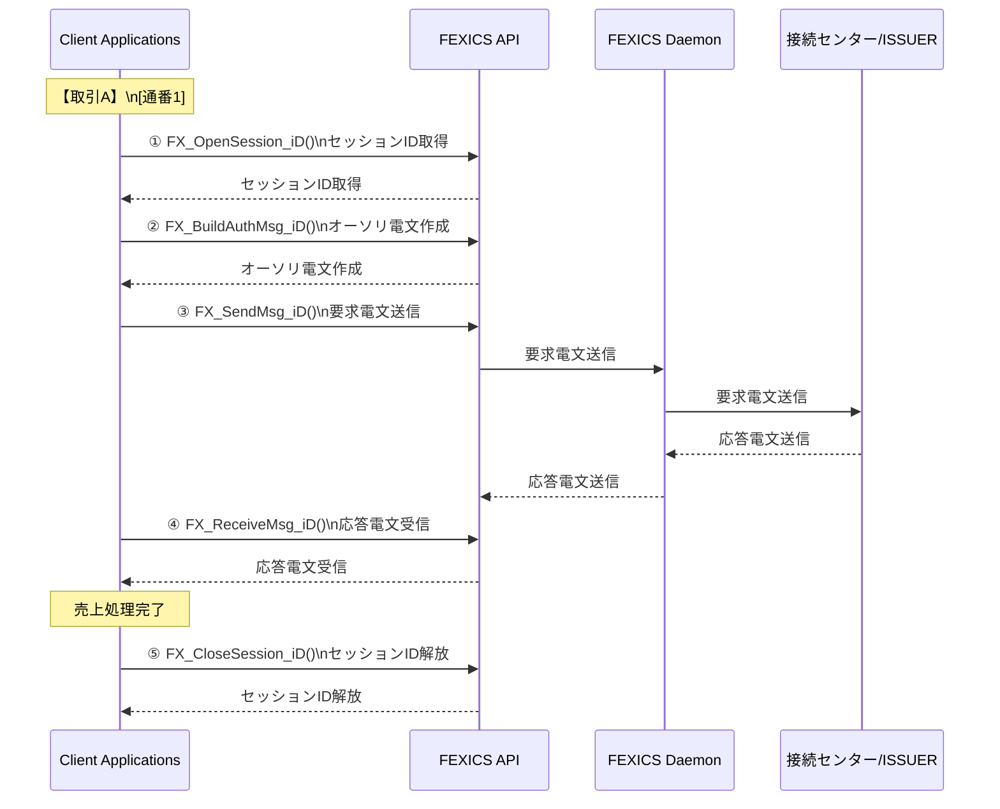

## 5.3. 仕向電文の処理パターン

この章では、仕向業務電文の処理方式を説明しています。

---

### 5.3.1. 仕向業務電文の処理方式

仕向業務電文の送受信は、**FX_SendMsg_CF()**、**FX_ReceiveMsg_CF()** を使用して行ないます。  
業務電文の処理形態として、以下の 2 パターンが存在します。

#### (1) 加盟店センターからの要求電文の送信、それに対応する応答電文の受信

図 5.3.1.1  加盟店からの要求による仕向業務電文の処理方式

この処理方式には、下記 4 つの API を使用して、①～④の手順で処理します。

① **FX_OpenSession_CF()**：FEXICS Daemon とのセッションを取得。  
② **FX_SendMsg_CF()**：要求電文を送信。  
③ **FX_ReceiveMsg_CF()**：要求電文に対する応答電文を受信。  
※②、③繰り返し  
④ **FX_CloseSession()**：FEXICS Daemon とのセッションを解放。  

---

#### (2) CAFIS センターからの要求電文の受信、それに対応する応答電文の送信

図 5.3.1.2  CAFIS センターからの要求による仕向業務電文の処理方式

この処理方式には、下記 4 つの API を使用して、①～④の手順で処理します。

① **FX_OpenSession_CF()**：FEXICS Daemon とのセッションを取得。  
② **FX_ReceiveMsg_CF()**：非同期電文が発生するまでコールし続け、CAFIS からの要求電文が発生したら受信。  
③ **FX_SendMsg_CF()**：要求電文に対する応答電文を送信。  
※②、③繰り返し  
④ **FX_CloseSession()**：FEXICS Daemon とのセッションを解放。  

※CAFIS センターからの要求電文については、FEXICS Daemon にて自動応答する電文と  
ユーザアプリケーションに転送される電文とがあります。  
詳細については「5.4 CAFIS センターからの要求電文の処理」を参照してください。

---

その他、FEXICS Daemon からのイベント通知を **FX_ReceiveMsg()** を使用して行なうことも出来ます。

#### (3) Daemon イベント通知の受信

図 5.3.1.3  FEXICS Daemon からのイベント通知受信

この処理方式には、下記 3 つの API を使用して、①～③の手順で処理します。

① **FX_OpenSession_CF()**：FEXICS Daemon とのセッションを取得。  
② **FX_ReceiveMsg_CF()**：FEXICS Daemon からのイベント通知を受信。  
※②繰り返し  
③ **FX_CloseSession()**：FEXICS Daemon とのセッションを解放。  

---

### 5.3.2. iD サービス固有の処理方式

iD サービスにおける仕向業務電文の送受信は、各業務電文用の編集 API および  
**FX_SendMsg_iD()**、**FX_ReceiveMsg_iD()** を使用して行ないます。  
業務電文の処理形態として、以下のようになります。

#### 例) オーソリ要求処理

図 5.3.2.1  加盟店からの要求による仕向業務電文の処理方式（iD サービス）

この処理方式には、下記 5 つの API を使用して、①～⑤の手順で処理します。

① **FX_OpenSession_iD()**：FEXICS Daemon とのセッションを取得。  
② **FX_BuildAuthMsg_iD()**：オーソリ要求電文を作成。  
　※業務内容に応じた電文編集 API を使用  
③ **FX_SendMsg_iD()**：要求電文を送信。  
④ **FX_ReceiveMsg_iD()**：要求電文に対する応答電文を受信。  
※②～④繰り返し  
⑤ **FX_CloseSession_iD()**：FEXICS Daemon とのセッションを解放。  
