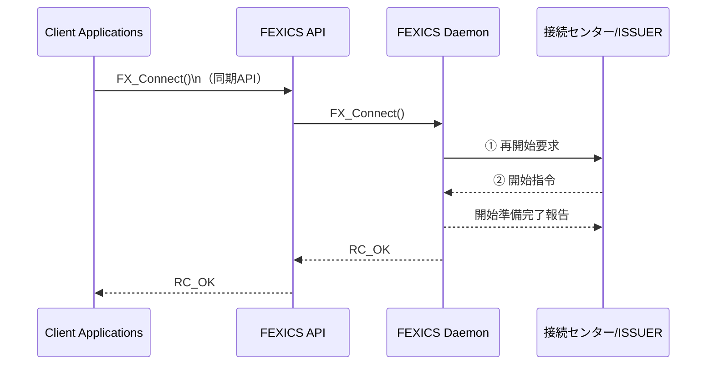
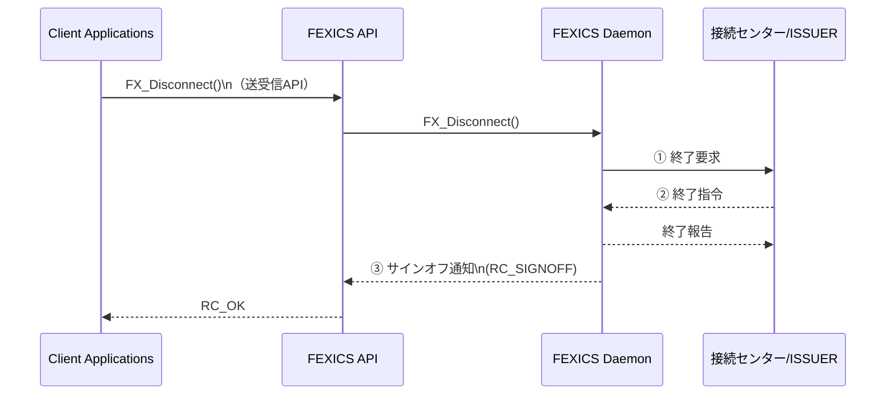

## 5.4. CAFIS センターからの要求電文の処理

CAFIS センターからの要求電文に応じて、FEXICS Daemon では  
自動応答、ユーザアプリケーションへ転送、電文破棄等の処理を行います。

CAFIS センターより送信される要求電文は、下記 3 つのパターンに分けられます。

- FEXICS Daemon にて自動応答を行う電文  
- API へ転送を行うか、FEXICS Daemon にて自動応答を行うかを設定により切り替えられる電文  
- FEXICS Daemon により破棄される電文  

---

### 5.4.1. 自動応答を行う CAFIS 要求電文

FEXICS Daemon にて自動応答を行う電文種別および、  
応答電文として送信される電文は下記のとおりです。

#### ＜CAFIS センターからの要求電文種別＞ → ＜FEXICS Daemon にて送信される応答電文種別＞

- 開始指令（0010） → 開始準備完了報告（0120）
- 終了予告指令（0610） → 終了準備完了報告（0620）
- 終了要求（0720） → 終了許可指令（0810）
- 終了指令（0910） → 終了報告（0920）
- 回線障害回復確認指令（9210） → 回線障害回復報告（9220）
- カウンタ通知（4110） → カウンタ完了報告（4120）

自動応答を行う際、受信した要求電文を編集し応答電文を作成します。  
編集を行う項目は、上記全ての電文に共通して下記の通りです。

| データ部 | データ項目 | 編集内容 |
|---|---|---|
| 共通制御ヘッダ部 | 電文種別 | 該当する報告電文種別コードをセット |

---

### 5.4.2. API 通知処理か自動応答処理の切替ができる CAFIS 要求電文

下記の電文については、FEXICS のコンフィグレーションパラメータ  
**CAFIS_RECONCILE_AUTO_REPLY** の設定により、API へ転送を行うか、  
FEXICS Daemon にて自動応答を行うかの処理の切替が可能な電文となります。

#### ＜CAFIS センターからの要求電文種別＞ → ＜FEXICS Daemon にて送信される応答電文種別（自動応答設定時）＞

- 与信要求（3110） → 与信拒否報告（3150）
- 売上要求（3210） → 売上拒否報告（3250）
- 取消要求（3310） → 取消拒否報告（3350）
- 照会要求（3410） → 照会拒否報告（3450）
- 事故カード中継要求（6110） → 事故カード中継拒否報告（6150）
- その他要求（3510）  
  → その他許可報告（3520）、その他拒否報告（3550）

※ その他要求電文については、より詳細な電文内容によって  
許可報告もしくは拒否報告を応答します。

#### 許可報告を行うその他要求電文

- サービス終了予告指令 → サービス終了準備完了報告
- サービス終了指令 → サービス終了報告
- サービスカウンタ照会指令 → サービスカウンタ照会報告

上記以外のその他要求電文については、全てその他拒否報告を応答します。

コンフィグレーションの設定により、上記電文が API への通知処理と  
されている場合は、ユーザアプリケーションにて  
応答電文の作成および送信を行う必要があります。

（API 通知とユーザアプリケーションによる応答については  
「5.3.1 仕向業務電文の処理方式」を参照してください）

---

#### 自動応答時の編集項目

##### ● 拒否報告電文を送信する場合

| データ部 | データ項目 | 編集内容 |
|---|---|---|
| 共通制御ヘッダ部 | 電文種別 | 該当する拒否報告電文種別コード “xx50” をセット |
| 1-0 | エラーコード | 対象業務外エラー “G98” をセット |

##### ● サービス終了予告指令に対し、サービス終了準備完了報告を送信する場合

| データ部 | データ項目 | 編集内容 |
|---|---|---|
| 共通制御ヘッダ部 | 電文種別 | その他許可報告電文種別コード “3520” をセット |
| 9-n | 制御コード | サービス終了準備完了報告 “20” をセット |

##### ● サービス終了指令、サービスカウンタ照会指令に対し、  
サービス終了報告およびサービスカウンタ照会報告を送信する場合

| データ部 | データ項目 | 編集内容 |
|---|---|---|
| 共通制御ヘッダ部 | 電文種別 | その他許可報告電文種別コード “3520” をセット |
| 9-n | 制御コード | 該当するコードをセット |
|  |  | ・サービス終了報告 “22” をセット |
|  |  | ・サービスカウンタ照会報告 “52” をセット |
| 9-n | 仕向カウンタ | FEXICS Daemon にて保持しているカウンタ情報をセット |
| 9-n | 被仕向カウンタ | 全ての項目に ALL “0” をセット |

（注）FEXICS Daemon では、被仕向け会社コード毎に  
下記 11 項目のカウンタを保持しています。

- 与信通数
- 与信金額
- 売上通数
- 売上金額
- 取消通数
- 取消金額
- 照会通数
- その他通数
- 事故カード通数
- IC オンラインオーソリ売上通数
- IC オンラインオーソリ売上金額

受信したサービス終了指令、サービスカウンタ照会指令電文中の  
項目［データ部 9-n：データパターンコード］によって、  
応答電文にセットされる仕向カウンタ情報が異なります。

###### 【データパターンコード “0”（IC オンラインオーソリカウンタ無し）の場合】

［データ部 9-n：仕向カウンタ］の「売上通数」および「売上金額」の項目に、  
FEXICS Daemon にて保持している  
「売上通数」と「IC オンラインオーソリ売上通数」の合算、  
「売上金額」と「IC オンラインオーソリ売上金額」の合算が  
それぞれセットされます。

そのほかの項目については、  
FEXICS Daemon にて保持しているカウンタの内容が  
そのままセットされます。

###### 【データパターンコード “B”（IC オンラインオーソリカウンタ有り）の場合】

［データ部 9-n：仕向カウンタ］の各項目に、  
FEXICS Daemon にて保持しているカウンタの内容が  
そのままセットされます。

---

### 5.4.3. FEXICS Daemon にて破棄される CAFIS 要求電文

下記の要求電文が CAFIS センターから送信された場合、  
FEXICS Daemon にて破棄されます。

#### ＜CAFIS センターからの要求電文種別＞

- カウンタ照会要求（4910）
- 再開始要求（7020）
- 取消指令（8910）
- 取消再指令（8920）
- 取消確認指令（8930）
- 取消確認再指令（8940）

破棄された電文については、  
FEXICS のイベントログファイルに記録されます。

---
## 5.5. 再開始、終了時の電文競合について

CAFIS 接続時の再開始および終了処理の際に電文競合が発生した場合、  
次のように処理されます。

---

### 5.5.1. 再開始処理時の電文競合



図 5.5.1  再開始処理時の電文競合

① **FX_Connect()** を受けて、FEXICS Daemon から再開始要求を送信します。  

② ① の応答を受信する前に CAFIS センターから開始指令を受信すると、  
FEXICS Daemon から自動応答で開始準備完了報告電文が送信されます。  
※再開始要求に対する応答はありません。  

③ 開始準備完了報告送信後、**FX_Connect()** は  
リターンコード **RC_OK** で終了し、  
FEXICS Daemon のステータスは **サインオン** となります。

---

### 5.5.2. 終了処理時の電文競合



図 5.5.2  終了処理時の電文競合

① **FX_Disconnect()** を受けて、FEXICS Daemon から終了要求を送信します。  

② ① の応答を受信する前に CAFIS センターから終了指令を受信すると、  
FEXICS Daemon から自動応答で終了報告電文が送信されます。  
※終了要求に対する応答はありません。  

③ 終了報告送信後、**FX_Disconnect()** は  
リターンコード **RC_OK** で終了し、  
FEXICS Daemon のステータスは **サインオフ** となります。


---

## 5.6. 精査不整合の原因となる電文判別

FEXICS では、API のリターンコードにより取るべき対応が判別できるようになっています。  
次項に記述されている **FX_ReceiveMsg_CF() / FX_SendSystemCancel_CF()** のリターンコードは、  
下記の分類になっています。

---

### 【精査不整合の発生しないリターンコード】

#### [FX_ReceiveMsg_CF()]

- **RC_OK**  
  ：正当な受信電文を CALLER のバッファにセットしました。

#### [FX_SendSystemCancel_CF()]

- **RC_OK**  
  ：取消処理を正常に完了しました。
- **RC_ERR_GETSEQNUM**  
  ：仕向処理通番の取得に失敗しました。
- **RC_ERR_SENDMSG**  
  ：電文の送信に失敗しました。
- **RC_NO_SESSION_ID**  
  ：指定したセッション ID が無効です。
- **RC_USE_SESSION_ID**  
  ：指定されたセッション ID は、他の API で使用されています。
- **RC_PKG_IS_SIGNOFF_OR_SWITCHING**  
  ：サインオフ状態、または状態遷移中のため電文を受信できません。
- **RC_ERR_ALL_CENTER_SESSION**  
  ：クレジット決済センターと FEXICS Daemon 間のセッションがすべて切断されています。
- **RC_INVALID_PARAM**  
  ：引数の数が不正です。または無効な値があります。

これらのリターンコードについては、  
クレジット決済センターからの応答電文から導き出したもの、  
あるいは電文の送信が行われていないものです。

そのため、クレジット決済センターと FEXICS Daemon 間  
（および API をコールするアプリケーション）での  
取引結果の認識は一致しています。

したがって、これらのリターンコードを受け取った取引の場合、  
**精査不整合は発生しません。**

---

### 【精査不整合の疑いのあるリターンコード】

#### [FX_ReceiveMsg_CF()]

- **RC_NO_SESSION_ID**  
  ：指定したセッション ID が無効です。
- **RC_TIME_OUT**  
  ：タイムアウトが発生しました。
- **RC_USE_SESSION_ID**  
  ：指定されたセッション ID は、他の API で使用されています。
- **RC_DATA_IS_NOT_READY**  
  ：まだ電文を受信していません（非同期受信モードのみ）。
- **RC_ERROR_API_INTERNAL**  
  ：API 内部にてシステムまたはプログラムのエラーが発生。
- **RC_ERROR_DAEMON**  
  ：Daemon 内部システムエラー。
- **RC_ERROR_SOCKET**  
  ：ソケットエラー。
- **RC_ERROR_CENTER**  
  ：Center から受信した電文が不正です。
- **RC_ERR_JOURNAL**  
  ：ジャーナルファイルエラーが発生しました。
- **RC_INVALID_PARAM**  
  ：引数の数が不正です。または無効な値があります。

#### [FX_SendSystemCancel_CF()]

- **RC_TIME_OUT**  
  ：タイムアウトが発生しました。
- **RC_ERR_CENTER_BUSY**  
  ：被仕向センターの経路がすべて使用中、  
  もしくは CAFIS センターが輻輳中です。
- **RC_ERROR_API_INTERNAL**  
  ：API 内部でシステムエラーが発生しました。
- **RC_ERROR_DAEMON**  
  ：Daemon 内部でシステムエラーが発生しました。
- **RC_ERROR_SOCKET**  
  ：FEXICS Daemon との接続が切断されました。  
  当該セッションをクローズしてください。
- **RC_ERROR_CENTER**  
  ：Center から受信した電文が不正です。
- **RC_ERR_SEARCHJOURNAL**  
  ：ジャーナルファイルの検索に失敗しました。
- **RC_ERR_RETRY_OVER**  
  ：障害取消電文を上限まで再送しましたが、  
  応答電文を受信できませんでした。

障害取消電文：  
- 取消確認指令  
- 取消確認再指令  
- 取消指令  
- 取消再指令  

これらのリターンコードについては、  
**電文送信を行ったうえで FEXICS Daemon がリターンコードをセットしたもの**です。

よって、クレジット決済センターとの  
**精査不整合を発生させる可能性のある取引は、これらの中に存在する**  
と言えます。

API をコールするアプリケーションは、  
これらのリターンコードが返った取引の

- 処理年月日  
- 端末識別番号  
- 端末処理通番  
- API からのリターンコード値  

を記録することで、  
ジャーナルから **精査不整合の疑いのある電文を表示することが可能**です。


---

## 5.7. 通番を特定してジャーナル内容を表示する方法

現在の FEXICS 標準のコマンドでは、  
下記の方法で **ジャーナルの特定レコードを表示**することができます。

精査不整合の疑いのあるリターンコードを受けた取引について、  
電文参照キーである以下の項目を指定します。

- 処理年月日  
- 端末識別番号  
- 端末処理通番  

### 例

処理年月日：**030303**  
端末識別番号：**3333333333333**  
端末処理通番：**12345**

の場合、コマンドフォーマットは以下のとおりです。

```
fxview_cf j j1_cf.dat /d030303 /t3333333333333 /s12345
```

指定した **電文参照キーが同じ電文はすべて表示**されます。

また、テキストファイルにリダイレクトして出力し、  
保存することも可能です。  
これにより、**ユーザアプリケーションへの取込みも容易な形**となります。
