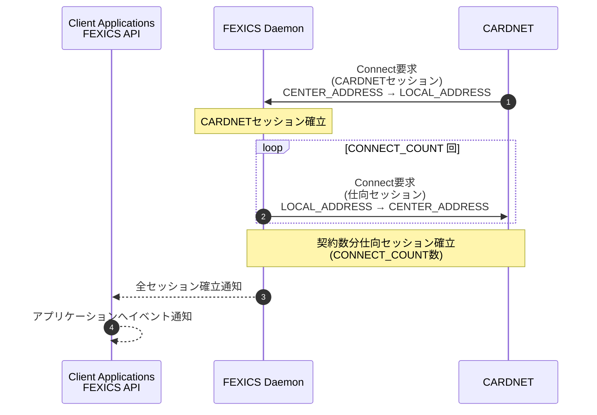
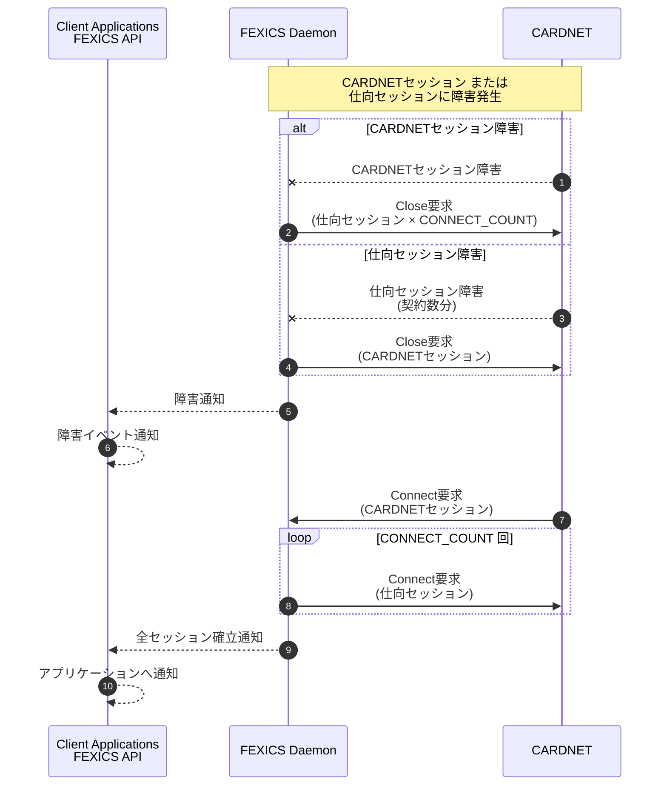
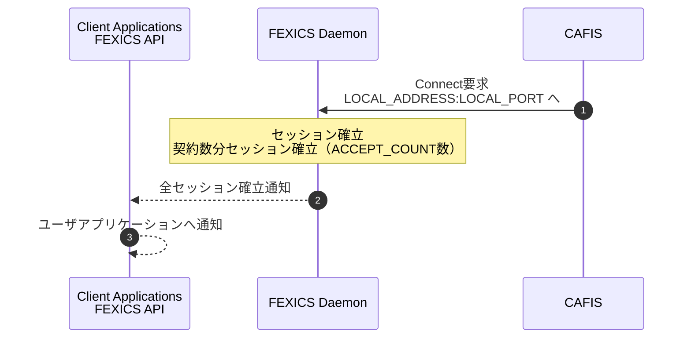
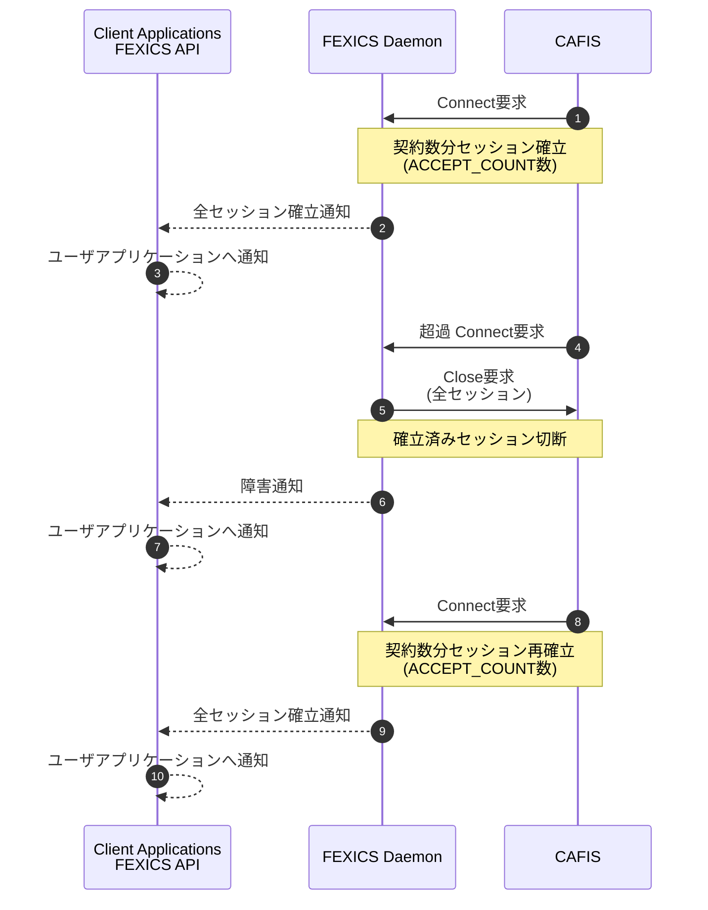

# 2. 運用

決済業務におけるFEXICSの運用手順としては、通常の店舗における日次ベースでの開始・終了を伴った運用や、オンライン店舗における24時間連続稼働など、いくつかのバリエーションがあります。

本章では、クレジット決済センターとの接続手順や、運用手順についての代表的な方法を下記項目別に説明しています。

## 項目
- クレジット決済センターとFEXICS Daemon間のセッションの確立
- オンライン開始・終了処理
- 通常の日次運用
- 24時間稼働時の運用
- 障害回復

## 2.1. センター間セッション確立手順

FEXICSは、クレジット決済センターとTCP/IPを利用して接続を行ないます。

FEXICS Daemonとクレジット決済センター間にて、セッションの確立、または切断が行なわれた場合、FEXICS Daemonは、変化したセッション状況を **FX_ReceiveMsg** にて受信します。

### [Daemon 通知内容]

- **RC_OK_CENTER_SESSION**  
  設定ファイルに指定した数分のセッションを確立しました。
- **RC_ERR_PART_CENTER_SESSION**  
  確立していたセッションの一部が切断されました。
- **RC_ERR_ALL_CENTER_SESSION**  
  確立していたセッションが全て切断されました。

セッション確立後、FEXICSとクレジット決済センター間の送信に使用されるセッションは、ラウンドロビン方式にて決定されます。

### 2.1.1. CARDNETセンター接続

FEXICSとCARDNETセンター間の接続は、以下の2種類のセッションで構成されます。

- CARDNETセンターからFEXICS稼動マシンに接続する **CARDNETセッション**
- FEXICS稼動マシンからCARDNETセンターに接続する **仕向セッション**

接続は、必ずCARDNETセッションから行なわれます。

#### [セッションの確立手順]

（図：2.1.1 セッション確立手順［CARDNET］）

1. CARDNETセンターからの接続要求を「LOCAL_ADDRESS：LOCAL_PORT」にて受信します。
2. ①のCARDNETセッション確立後、「CONNECT_COUNT」に指定された数の接続要求を「CENTER_ADDRESS：CONNECT_PORT」に対し発行します。
3. すべてのセッションが確立された時点で、FEXICS DaemonからFEXICS APIに対しイベント通知を行います。
4. ユーザアプリケーションにイベントを通知します。

#### [セッション障害時]

（図：2.1.1 セッション障害時［CARDNET］）

1. CARDNETセッション、または契約数分の仕向セッションにて障害（切断）が発生した場合、そのセッションと対になっている仕向セッション、またはCARDNETセッションもクローズします。
2. FEXICS DaemonからFEXICS APIに対しイベント通知を行います。
3. ユーザアプリケーションにイベント通知します。
4. CARDNETセンターからのCARDNETセッションの接続要求を受信し、切断したセッションを再び確立します。
5. 全セッションが正常に確立後、FEXICS Daemonよりイベント通知を行います。
6. ユーザアプリケーションにイベント通知します。

※ 指定数を超過する接続要求をCARDNETセンターから受信した場合は、既存の接続が破棄されたものとして、新しい接続要求との確立を行い、超過分の古いセッション（CARDNETセッション）をクローズします。その際、CARDNETセッションだけではなく、対応する仕向セッションも接続し直します。

### 2.1.2. CAFISセンター接続

FEXICSとCAFISセンター間の接続は、CAFISセンターからの接続要求により確立されます。

#### [セッションの確立手順]

（図：2.1.2 セッション確立手順［CAFIS］）

1. CAFISセンターからの接続要求を「LOCAL_ADDRESS：LOCAL_PORT」にて受信します。
2. 設定ファイルに指定したすべてのセッションが確立された時点で、FEXICS DaemonからFEXICS APIに対しイベント通知を行います。
3. ユーザアプリケーションにイベントを通知します。

#### [超過セッション接続時]

（図：2.1.2 超過セッション接続時［CAFIS］）

1. 契約数分のセッションを確立します（イベント通知あり）。
2. 契約数を超過する接続要求を受信した場合、接続している全てのセッションを切断します。
3. FEXICS DaemonからFEXICS APIに対しイベント通知を行います。
4. ユーザアプリケーションにイベントを通知します。
5. CAFISセンターからの再接続要求を受信し、契約数分のセッションを確立します。
6. FEXICS DaemonからFEXICS APIに対しイベント通知を行います。
7. ユーザアプリケーションにイベントを通知します。

※ FEXICS Daemonは受信した電文中の共通制御ヘッダ部のトレーラレングスより電文の組立／分割を行います。  
電文の組立／分割にエラーが発生した場合は、当電文を受信したセッションを切断し、CAFISセンターからの再接続を待ちます。
