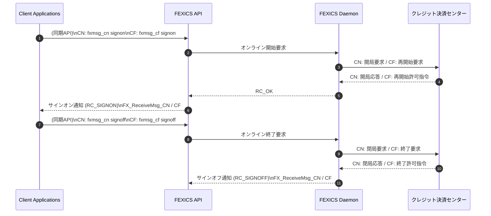
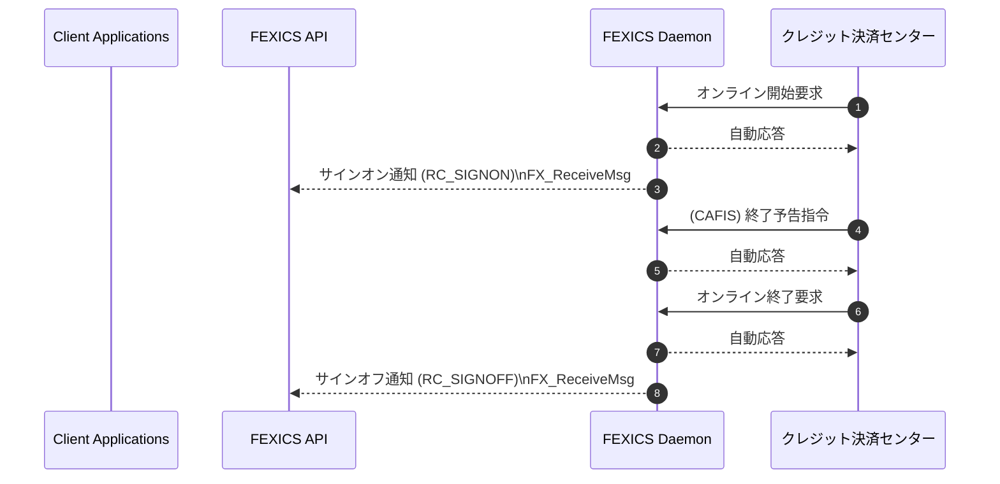

# 2.2. 業務開始・終了手順

クレジット決済センターとのオンライン開始・終了手順を下記に図示します。  
FEXICS Daemon とクレジット決済センター間にて FEXICS Daemon ステータスを変更する電文が送受信された場合は、  
変更後の FEXICS Daemon ステータスを **FX_ReceiveMsg** にて受信します。

## [FEXICS Daemon 通知内容]

- **RC_SIGNON**  
  FEXICS Daemon ステータスが、「サインオフ」から「サインオン」に移行しました。
- **RC_SIGNOFF**  
  FEXICS Daemon ステータスが、「サインオン」から「サインオフ」に移行しました。

## [クレジット決済センター省略名]

- **CN** ： CARDNET センター  
- **CF** ： CAFIS センター  

図中では、センター略名にあわせて、それぞれのクレジット決済センターにて送受信される電文名を記述しています。

---

## 2.2.1. 加盟店からの開始・終了処理

加盟店からオンライン開始、終了の要求を発行する手順を示します。  
図中では、①～②が開始処理、③～④が終了処理を示しています。  
下記 API の代わりに **fxmsg コマンド**を使用しても同様の処理が行なえます。

（図：2.2.1 加盟店からの開始・終了処理）

### 処理説明
1. fxmsg コマンドの signon にて、クレジット決済センターとのオンライン開始処理を実行します。  
2. FEXICS Daemon のステータス変更結果（サインオン通知）を API に送信します。  
3. fxmsg コマンドの signoff にて、クレジット決済センターとのオンライン終了処理を実行します。  
4. FEXICS Daemon のステータス変更結果（サインオフ通知）を API に送信します。

---

## 2.2.2. クレジット決済センターからの開始・終了処理

クレジット決済センターからオンライン開始、終了が発行された場合の処理手順を示します。  
図中番号①～②が開始処理、③～⑤が終了処理となります。

（図：2.2.2 クレジット決済センターからの開始・終了処理）

### 処理説明

1. クレジット決済センターからのオンライン開始要求に対し、FEXICS Daemonは自動に応答します。

2. FEXICS Daemonのステータス変更の結果（サインオン通知）をAPIに送信します。  
   （FX_ReceiveMsgにて受信します）

3. CAFISセンターからの終了予告指令に対し、FEXICS Daemonは自動に応答します。

4. クレジット決済センターからのオンライン終了要求に対し、Daemonは自動応答を返します。

5. FEXICS Daemonのステータス変更の結果（サインオフ通知）をAPIに送信します。  
   （FX_ReceiveMsgにて受信します）
