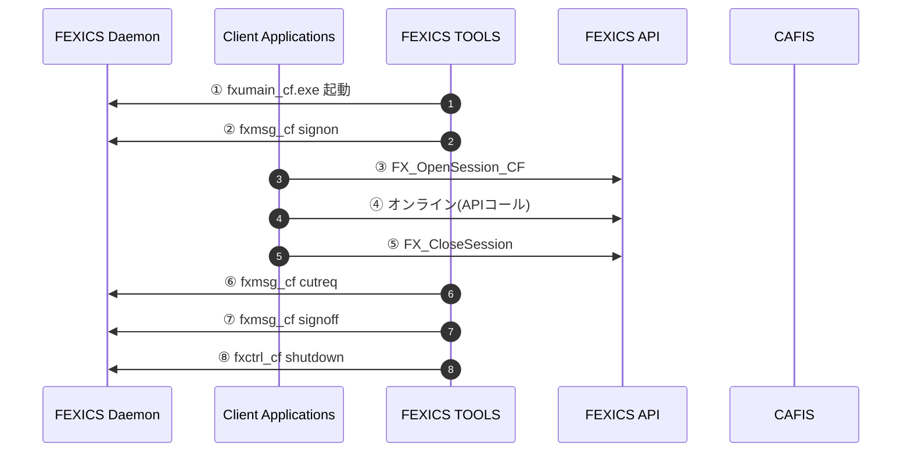
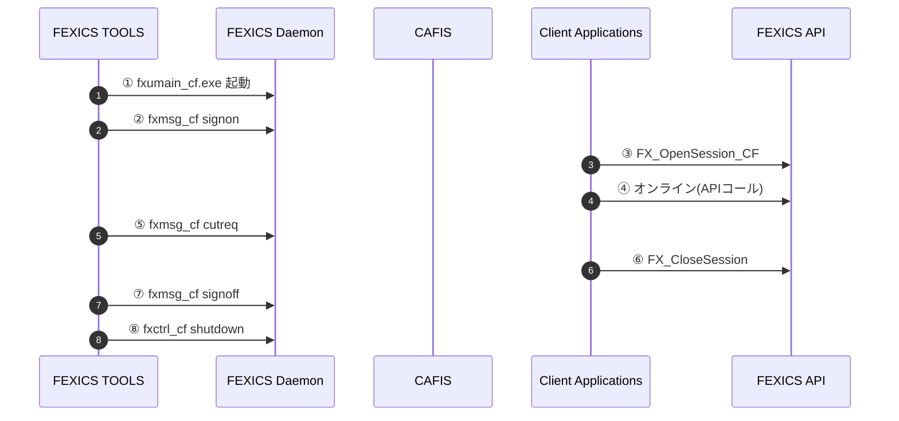
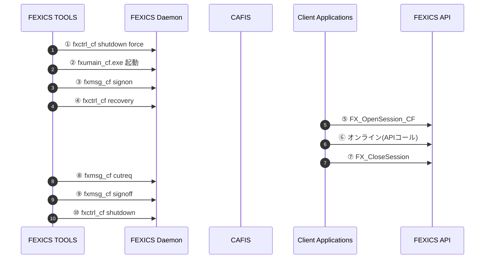

# 2.4. CAFISセンター接続サービスの運用手順

CAFISセンターと接続した場合の通常の日次運用、24時間稼動時の考慮事項、および障害回復の代表的な運用手順を示します。

---

## 2.4.1. 通常の運用手順

日次業務を行うための通常の運用手順は下記のとおりです。

（図：2.4.1 通常の運用手順［CAFIS］）

### 処理説明

1. FEXICS Daemonを起動します。  
2. CAFISセンターにサインオンします。（「2.2.1 加盟店からの開始・終了処理」参照）  
3. APIとFEXICS Daemonのセッションをオープンします。  
4. オンライン処理（業務処理）  
5. APIのセッションをCloseします。  
6. FEXICS Daemonのカット対象日付を更新します（業務の開始、または終了時に実行）。  
7. クレジット決済センターとのオンライン終了処理を実行します。（「2.2.1 加盟店からの開始・終了処理」参照）  
8. FEXICS Daemonを停止します。  

---

## 2.4.2. 24時間稼働時の運用手順

サインオンおよびサインオフは、日次には行いません。  
また、アプリケーションも常時稼働することを前提に設計しなければなりません。

（図：2.4.2 24時間稼働時の運用手順［CAFIS］）

### 処理説明

1. FEXICS Daemonを起動します。  
2. CAFISセンターにサインオンします。（「2.2.1 加盟店からの開始・終了処理」参照）  
3. APIとFEXICS Daemonのセッションをオープンします。  
4. オンライン処理（業務処理）  
5. カット対象日付を更新します。  
6. APIとFEXICS Daemonの接続を切り離します。  
   - 業務プログラムは随時停止して入替え、再起動が可能です。  
7. 停止する時は、クレジット決済センターとのオンライン終了処理を実行します。  
   - （「2.2.1 加盟店からの開始・終了処理」参照）  
8. 原則的にメンテナンス時のみFEXICS Daemonを停止します。  

---

## 2.4.3. 障害復旧時再始動

fxctrl_cf shutdownで終了しなかった場合（例：システムダウンやfxctrl_cf shutdown force使用時）は、  
前回終了時に仕掛中だった電文（保留電文）の後処理をすべて終了させてから業務を再開する必要があります。  

通常の起動と同様にfxumain_cfを起動し、CAFISセンターにサインオンした後に、  
リカバリ処理（仕掛中要求電文の取消（再）指令または取消確認（再）指令）を行い、その後通常業務を開始します。

（図：2.4.3 障害復旧時再始動［CAFIS］）

### 処理説明

1. FX_CtrlShutdown、または `fxctrl_cf shutdown` での正常終了ができなかった場合、リカバリ処理が必要です。  
2. FEXICS Daemonを起動します。  
3. CAFISセンターにサインオンします。（「2.2.1 加盟店からの開始・終了処理」参照）  
4. `fxctrl_cf recovery` にて、仕掛け中の要求電文のシステム取消処理を行ないます（リカバリ処理）。  
5. FEXICS Daemonのセッションをオープンします。  
6. オンライン処理（業務処理）  
7. APIのセッションをクローズします。  
8. 業務終了後、カット対象日付を更新します。  
9. クレジット決済センターとのオンライン終了処理を実行します。（「2.2.1 加盟店からの開始・終了処理」参照）  
10. FEXICS Daemonを停止します。  
